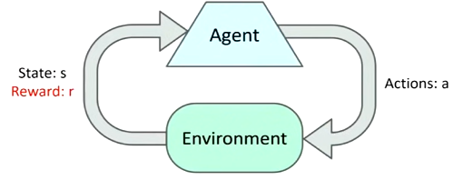
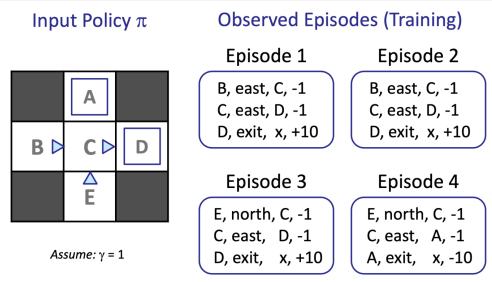
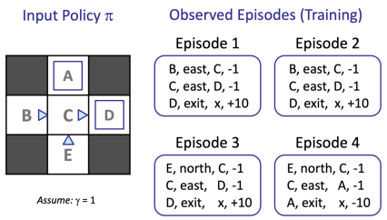
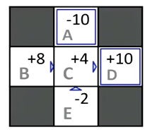
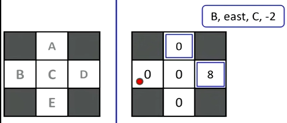
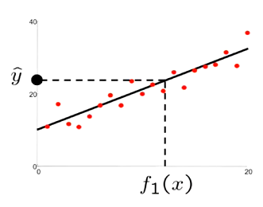

# Reinforcement Learning

- General idea
    - Agent chooses some action to do
    - The environment will change based on that action
    - Agent receives feedback in the form of rewards (whether good or bad)
    - Learns how to maximize its expected utility
- A key difference in RL is that it's hard to build a reliable test environment
    - Labs are much different than real worlds
    - Hard to obtain the perfect space
- We assume a MDP
    - We have set of states $S$, set of actions $A$, transition model $T$, reward function $R$, and policy $\pi$
- The twist is we don't know $T$ or $R$
    - Don't know which actions or states are the best
    - Need to try out actions and figure out which is best
- RL uses online calculation
    - Different than MDP policy, which is offline
- Types of RL
    - Model-based
    - Model-free
    - Passive
    - Active

## Model-Based
- Develop a model based on experiences
    - Assume model is correct and solve for values
- Step 1: Learn empirical MDP model
    - Take a bunch of actions $a$ and observe the resulting $s'$
    - Come up with an estimation of $\hat{T}(s,a,s')$ function
    - Same thing with reward $\hat{R}(s,a,s')$
- Step 2: Solve the learned MDP
    - Note that this is not a true MDP (only an approximation)
    - Ex: use value iteration

### Example

- Every time we go east from $B$, we end up in $C$
    - $\rArr T(B,east,C)=1.00$
- Going east from $C$ goes to $D$ 3/4 times, and $A$ 1/4 times
    - $\rArr T(C,east,D)=0.75$
    - $\rArr T(C,east,A)=0.25$
- Likewise for the $\hat{R}$ function, we need to find average reward for each $(s,a,s')$
- As we collect data, we learn new things about the environment
    - We continue to fine tune our policy

### Model-Based vs. Model-Free
- Suppose we want to compute expected age of a group of students
    - We don't have $P(a)$, or the probability of an age occurring
    - There are 2 approaches to this problem
- Model-based
    - Take a sample of 20 students and compute $\hat{P}(a)$ based on the sample
    - Then apply the estimate model into: $E[a]\approx\sum_a\hat{P}(a)\cdot a$
- Model-free
    - Directly calculate the expected age from sample: $E[A]\approx \frac{1}{n}\sum_na_n$
    - The probabilities are already reflected in our sample
    - If $P(x)$ has high probability, then our sample will have a lot of $x$'s
- Both approaches gives us the exact number
- There are 2 kinds of model-free:
    - Passive
    - Active

## Passive RL
- Problem structure
    - Input: a fixed policy $\pi$
    - $T$ and $R$ functions are unknown
    - Goal: learn the state values
- We don't worry about what actions to take
    - We only do actions and *observe*
    - We just execute policy and learn from experience
    - This is **not** offline planning since we're doing actions
- There are 2 kinds of passive RL: direct and indirect

### Direct Evaluation
- Goal: Compute values for each state under policy $\pi$
- Average together observed sample values
    - Act according to $\pi$
    - Write down the sum of discounted rewards for each state
    - Average

- $A$ we only visited once and got $-10$
- $D$ we visited 3 times, and got $+10$ every time
- $B$ we get 8 both times
    - Ep1: $(-1)+(-1)+(10)=8$
    - Ep2: $(-1)+(-1)+(10)=8$
- $C$ we get different results
    - Ep1-3: $(-1)+(10)=9$
    - Ep4: $(-1)+(-10)=-11$
    - Average $=3\cdot9+(-11)=16\rArr 16/4=4$
- $E$ we get different results
    - Ep3: $(-1)+(-1)+(10)=8$
    - Ep4: $(-1)+(-1)+(-10)=-12$
    - Average $=8+(-12)=-4\rArr -4/2=-2$
- Final result: 
- Pros
    - Easy to calculate
    - Doesn't require knowledge of $T$ and $R$
    - Eventually computes average value
- Cons
    - Wastes info about state connections
        - $B$ and $E$ should have the same value since they both have to go through $C$
        - Inconsistent
    - Each state is learned separately
    - Takes a long time
- We can't use policy evaluation since it depends on $T$ and $R$
- Sample-based policy evaluation is a potential alternative
    - Run a bunch of samples to approximate $T$ and $R$
    - Problem with this is that it's not feasible
    - In the environment, we can't reset to a starting state easily

### Temporal Difference Learning (TDL)
- Idea is to update from every experience
    - Update $V(s)$ every time we experience a transition $(s,a,s',r)$
    - A common state $s'$ will result in more frequent updates
- We're still working with a fixed policy
    - We keep a running average of the states we encounter
- First, we get a sample
    - $sample=R(s,\pi(s),s')+\gamma V^\pi(s')$
- Then we update it
    - $V^\pi(s)\larr(1-\alpha)V^\pi(s)+\alpha(sample)$
    - $\alpha$ is the <u>learning rate</u>
    - Indicates how much of the current value do we keep
- We can interpolate $\alpha$
    - Makes recent samples more important
    - Old data is usually false anyways
- Decreasing the learning rate can also converge averages

#### Example
 assume $\gamma=1,\alpha=0.5$
- $sample=R(B,east,C)+\gamma V(C)$
    - $\rArr sample=(-2)+(1)(0)=-2$
- $V^\pi_{new}(s)=(1-\alpha)V^\pi_{old}(s)+\alpha(sample)$
    - $\rArr V^\pi_{new}(s)=(1-(0.5))(0)+(0.5)(-2)=-1$
- We can repeat this process for every transition that we observe
- Note that the only value that changed is $B$
    - This is because $B$ is the only observation
    - We learned nothing new of the other states

#### Problems
- TDL is a model-free way to evaluate policies
    - Mimicks Bellman updates with running averages
- However, we can't turn these values into a new policy
- Idea is to learn Q-values, not values
    - Makes action selection model-free too

## Active RL
- We now get to choose our actions
    - We learn from Q-values to determine best action
- We have a trade-off between exploration and exploitation
    - Generally we want to keep doing what we found is good
    - However, we also want to do something new since it might accelerate learning
- This is still not offline planning
    - We are acting and computing

### Q-Learning
- We can already find values from successive depth-limited values
    - However, we want the Q-values
    - We can just directly compute them instead
- Given $Q_k$, find q-values for all q-states at depth $k+1$
    - $Q_{l+1}(s,a)=\sum_{s'}T(s,a,s')[R(s,a,s')+\gamma\cdot\max_{a'}Q_k(s',a')]$
- Q-learning is a sample-based Q-value iteration
    - Learn $Q(s,a)$ values as we go
    - Similar to direct evaluation, we keep a running average of values
    - Use learning rate $\alpha$ as well
- Equations
    - $sample=R(s,a,s')+\gamma\max_{a'}Q(s',a')$
    - $Q(s,a)=(1-\alpha)Q(s,a)+\alpha\cdot sample$
- Initially, all q-values are 0
    - Each action doesn't result in anything
    - Once we hit a terminal state, we finally get a reward
    - We now reset
- Gradually, across each iteration, the terminal state will propagate down the line

### Q-Learning Properties
- Q-learning will converge to optimal policy
    - Even if acting sub-optimally
- This is called off-policy learning
- Caveats
    - You need sufficient exploration
    - Learning rate has to eventually be small enough
    - But can't decrease too quickly

## Exploration vs Exploitation
- Idea of exploration is to try new states and see if they're better
- One way is with randomness
    - With (small) probability $\epsilon$, do something random
    - Otherwise follow the current policy
- There are problems with randomness
    - Even if learning is done, we will still thrash around randomly
    - A solution is to lower $\epsilon$ over time
    - A better one is exploration functions

### Exploration Functions
- We could explore a fixed amount
- Better idea is to limit exploration to unknown areas
    - Don't explore areas that are already determined to be good/bad
- Take estimated value and visit count to get: $f(u,n)=u+k/(n+1)$
    - $u$ is expected utility
    - $k$ is some correction constant
    - $n$ is how many times we've seen this $(u,n)$ pair
- We can now change our Q-update function
    - Original: $Q(s,a)=R(s,a,s')+\gamma\cdot\max_{a'}Q(s',a')$
    - New: $Q(s,a)=R(s,a,s')+\gamma\cdot\max_{a'}f(Q(s',a'),N(s',a'))$
- The more times $N$ we've visited a pair, the less likely we are to explore there
    - Unexplored states have a sort of "unexplored bonus reward"
    - We'll still go this route if Q-values are high

### Regret
- Even if we learn an optimal policy, we still make mistakes along the way
    - How can we minimize repeating past mistakes?
- Regret is a measure of total mistake cost
    - Difference between expected rewards and optimal expected rewards
- Minimizing regret involves learning optimally
    - Ex: random exploration and exploration functions both are optimal
    - However random has higher regret
- We'll never have 0 regret

## Generalizing Across States
- Basic Q-learning stores all q-values
    - Not feasible for a very large number of states
    - Impossible to visit all
    - Impossible to store all in memory
- We want to generalize states instead
    - Learn about a few training states first
    - Generalize that experience to new, similar situations
    - Fundamental idea in ML
- These 3 states are very similar: 
    - However, the appear as 3 completely different states

### Feature-Based Representations
- We can describe state with a vector of features (properties)
    - Functions that convert states into real numbers
    - Captures the important properties of a state
- Pacman example features
    - Distance to closest ghost
    - Distance to closest food
    - Number of ghosts
- Can also be used for q-states
    - Ex: action moves closer to food, farther from ghost, etc.

### Linear Value Functions
- We can calculate values and q-values with weighted functions
    - $V(s)=w_1f_1(s)+w_2f_2(s)+...+w_nf_n(s)$
    - $Q(s,a)=w_1f_1(s,a)+w_2f_2(s,a)+...+w_nf_n(s,a)$
- Idea is to get as precise as possible
    - Doesn't have to perfect, just good enough
- Advantage: experience is summed in few powerful numbers
- Disadvantages: states with similar features may actually be different in value
    - We need enough features
    - Optimizing

### Approximate Q-Learning
- We have the following equations
    - $difference=[r+\gamma\max_{a'}Q(s',a')]-Q(s,a)$
    - $Q(s,a)=Q(s,a)+\alpha[difference]$
- However, we want the weights instead of q-values: $w_i=w_i+\alpha[difference]f_i(s,a)$
    - If difference is positive, it means our sample is better than current approximation
    - If difference is negative, it means our sample was worse than current approximation
- The amount of correction is determined by $f_i$
    - Since $Q$ is either 0 or 1, so $difference\in\{-1,0,1\}$
    - Big $f_i$ = bigger role in state = bigger correction

### Pac-Man Example
- Initial conditions
    - $Q(s,a)=4.0f_{DOT}(s,a)-1.0f_{GHOST}(s,a)$
    - $f_{DOT}(s,NORTH)=0.5$
    - $f_{GHOST}(s,NORTH)=1.0$
- Suppose we go $NORTH$ and get eaten by a ghost and die
    - Estimate is $r+\gamma\max_{a'}Q(s',a')=-500+0$
    - $Q(s,NORTH)=4.0(0.5)-1.0(1.0)=2.0-1.0=1.0$
    - $difference=-501$
- We now adjust our equations
    - $w_{DOT}=4.0+\alpha[-501]\cdot0.5$
    - $w_{GHOST}=-1.0+\alpha[-501]\cdot1.0$
- Final result: $Q(s,a)=3.0f_{DOT}(s,a)-3.0f_{GHOST}(s,a)$

### Minimizing Error

- We want to find a line of best fit for some points
    - $\hat{y}=w_0+w_1f_1(x)$
    - This can be expanded into multi-dimensions to accommodate multiple weights
- We find total error with $\sum_i(y_i-\hat{y}_i)^2$
    - Find difference to between line and actual
    - Square to get rid of negatives (since we don't want them to cancel out)
- Idea is to figure out which direction to adjust weight to minimize error
    - We use slope values to figure out which direction to go
    - We see which way the error goes up, and then move in the opposite direction
- We also don't want to minimize error to 0
    - This will result in overfitting

## Policy Search
- Sometimes, optimal feature-based policies have terrible $V$/$Q$ estimates
    - Ex: Project 2 had good policies, but bad estimates
    - Good Q-value estimates *leads* to better performance, but is not guarantee
- Instead of focusing on values, we focus on the best action
    - Start with an ok policy and fine tune it until it's good
- Simplest policy search
    - Start with initial linear function
    - Adjust weights until we're good
- Issues
    - How to tell if policy is better?
    - We need to run a ton of samples
    - Lots of features makes it too complicated
- There are better methods
    - Exploit lookahead
    - Sample wisely
    - Change multiple parameters at at time
