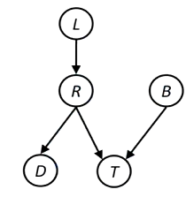

# Bayes' Nets: Representation
- Probabilistic Models describe how *a portion* of the world works
- Models are always simplistic
    - May not account for every random variable
    - May not account for all interactions between variables
- Goal is not to find a correct model, but a useful one
- Agents use models to reason about unknown variables
    - Ex: explanation, prediction, value of information

## Independence
- 2 variables are independent if $P(x,y)=P(x)P(y)$
    - Another form is $P(x|y)=P(x)$
- This is written as $X \perp \!\!\! \perp Y$
- Independence is a form of model assumption
    - Sometimes, we ignore possible weak interactions between variables
    - There may be imperfect independence
- Ex: Suppose we have a set of $\{Weather, Traffic, Cavity, Toothache\}$
    - We can split this into 2 independent subsets $\{Weather, Traffic\},\{Cavity, Toothache\}$

### Example

- From the table, we can see $P_1(hot,sun)=0.4$
    - We then check $P_1(hot,sun)=P_1(hot)P_1(sun)=0.3$
    - They're different, so they're *not* independence

- This table is obvious that temperature and weather are independent
- Simpler since we can just give $P(T)$ and $P(W)$
    - Give the marginal distributions and the fact they're independent
- Generally speaking, we don't ever have true independent variables
    - When we make a model, we only include variables we care about
    - These variables will probably have some sort of interaction with each other
    - However, independence paves the way to conditional independence

## Conditional Independence
- Suppose we are at the dentist and are searching for a cavity
- The results depend on:
    - If you have a toothache
    - If you have a cavity
    - If the probe actually catches on the hole
- The probability of catch doesn't depend on toothache
    - $P(+catch|+toothache, +cavity)=P(+catch|+cavity)$
- If I don't have a cavity, it also doesn't depend on toothache
    - $P(catch|toothache, -cavity)=P(catch|- cavity)$
- However, this doesn't mean toothache is independent of catch
    - Toothache might mean I have a cavity, affecting the chance of a catch
    - Toothache is only independent once we know we have a cavity for sure
- This means catch is <u>conditionally independent</u> on toothache
    - $P(+toothache|+catch,+cavity)=P(+toothache|+cavity)$
    - $P(+toothache, +catch|+cavity)=P(+toothache|+cavity)P(+catch|+cavity)$
- Conditional independence is an assumption that simplifies distributions
    - A lot more common than absolute independence

### Example
- Suppose domain is $\{traffic, umbrella, raining\}$
    - We can say $T \perp \!\!\! \perp U | R$
    - Traffic is independent of umbrellas if we know it's raining
    - Not marginally independent, but conditionally independent
- Suppose domain is $\{fire,smoke,alarm\}$
    - We can say $A \perp \!\!\! \perp F | S$
    - If we know something about the smoke, then the alarm is independent of whether there's fire (ex: cooking burned something)
    - If the sensor also relied on temperature, then this would be a poor model

### Chain Rule
- Chain rule: $P(X-1,X_2,...,X_n)=P(X_1)P(X_2|X_1)P(X_3|X_1,X_2)...$
- Ex: $P(traffic,rain,umbrella)$
    - $\rArr P(rain)P(traffic|rain)P(umbrella|rain,traffic)$
- Note that previously we determined traffic and umbrellas were conditionally independent
    - If we know it's raining, then our equation simplifies
    - $\rArr P(rain)P(traffic|rain)P(umbrella|rain)$

## Bayes' Nets
- 2 problems with full joint distribution tables
    - Lots of variables = huge tables
    - Learning cost is huge with lots of variables
- Size comparisons
    - A table with $N$ boolean variables has size $2^N$
    - A $N$-node net with $k$ parents is $N2^{k+1}$
        - BN has huge savings (as long as there's not too many parents)
- <u>Bayes' Nets</u> are a way to represent joint distributions
    - Describes how variables interact
    - Local interactions can chain together into global, indirect interactions
- Insurance example: // insert 45:26
    - A full joint distribution table for this would be huge
    - 30 variables, with 10 states, would be $10^{30}$ entries
    - Accident has direct interaction with driving quality
    - Accident has indirect interaction with age

### Graphical Model Notation
- Nodes are variables
    - Variables have domains
    - Can be assigned (observed) or unassigned (unobserved)
- Arcs are interactions
    - Similar to CSP constraints
    - Show direct interactions/influences
- Dentist example: //51:04
    - Toothache and cavity are *directly* related
    - Catch and cavity are *directly* related
    - Toothache and catch are *indirectly* related
- For now, think of arrows as "direct causation"
- Coin flip example

### Examples
- Coin flips
    - We have $N$ independent coin flips
    - No interactions between variables (absolute independence)
    - // 54:40
- Traffic
    - Variables are $\{R,T\}$ (rain, traffic)
    - models // 55:44
    - Model 2 is better since it helps us use evidence to change beliefs of variables
- Traffic II
    - Variables
        - $T$: there's heavy traffic
        - $R$: it's raining
        - $L$: low pressure
        - $D$: roof is dripping
        - $B$: ballgame
        - $C$: I have a cavity
    - Model: // 58:50
- Alarm Network
    - Variables
        - $B$: burglary
        - $A$: alarm goes off
        - $M$: neighbor Mary calls
        - $J$: neighbor John calls
        - $E$: earthquake
    - We make a lot of assumptions here
        - Does the earthquake trip the alarm?
        - Are Mary and John calling because they see the burglar?
        - These all affect our model

## Probabilities   
- A Bayes' Net is:
    - Set of nodes, one per variable
    - A DAG (directly acyclic graph)
    - A conditional distribution for each node
- BN can implicitly encode joint distributions
    - Product of local conditional distributions
    - $P(x_1,x_2,...,x_n)=\prod_{i=1}^nP(x_1|parents(X_i))$
    - Parent is a node that's pointing to the current node
- Ex: // 1:09:00
    - $P(+cavity, +catch, -toothache)=P(+cavity)P(+catch|+cavity)P(-toothache|cavity)$
    - We have all these pieces in the BN, so we can find this value
- BN uses chain rule with assumptions about conditional independence

### Examples
- Coin flips // 1:12:05
    - $P(h,h,t,h)=0.5^4$
    - Variables will always be independent
- Traffic // 1:13:00
    - $P(+t,-r)=P(r)P(-t|+r)=\frac{1}{4}\cdot\frac{1}{4}$
- Reverse traffic: // 1:18:13
    - Suppose we say traffic causes rain
    - Notice that the joint probability distributions are the exact same
    - This is due to the Chain Rule and the fact that $P(T)P(R|T)\iff P(R)P(T|R)$

### Causality
- We ideally want BN to reflect true causal patterns
    - Ex: how many people with strep throat have fever vs how many people with fever has strep throat?
    - Usually simpler with fewer nodes
    - Easier to think about
    - Easier to elicit from experts
- BN do not need to be actually causal
    - Sometimes domains aren't causal
    - Ex: $traffic$ and $roofDrips$
    - Arrows end up being correlation, not causation
- Arrows do not necessarily mean causation
    - Can sometimes mean it
    - Actually represent conditional independence

# Independence
- All distributions can be represented with a chain rule
    - BN conditions just on the parents
    - Instead of all past variables
- If set of parents is less than all preceding variables, we have made an assumption
    - Easier to write out conditional tables
    - Can no longer represent all distributions

- Chain rule says $P(x,y,z,w)=P(x)P(y|z)P(z|x,y)P(w|x,y,z)$
- BN says $P(x,y,z,w)=P(x)P(y|x)P(z|y)P(w|z)$
- In order to add more assumptions, we have to add more arrows
- Independencies
    - $z\perp\!\!\!\perp x|y$
    - $w \perp\!\!\!\perp x,y|z$
    - $w\perp\!\!\!\perp x|y$
- Can 2 nodes be proven to be independent with evidence?
    - Yes: needs tedious algebra
    - No: prove with counter example
- Ex: Are $X$ and $Z$ independent? 
    - $X$ and $Z$ are not guaranteed to be independent
        - $X$ can influence $Y$, which influences $Z$ (and vice versa)
    - $X$ and $Z$ could be independent
        - Make $X$,$Y$,$Z$ all be independent coin flips

## D-Separation
- <u>D-separation</u> is a condition/algorithm to figure out independence of variables
    - Idea is to study independence properties of triples
    - Analyze complex cases in terms of member triples
- There are 3 kinds of triples
    - Casual Chain
    - Common Cause
    - Common Effect

### Casual Chain Triple

- $P(x,y,z)=P(x)P(y|x)P(z|y)$
- $x$ cannot be guaranteed independent from $z$ due to $y$
    - Low pressure can cause rain which causes traffic
    - High pressure means no rain which leads to no traffic
- What if $y$ is given?
    - Intuitively, yes
    - If we know $y$, it doesn't matter what $x$ is in order to know $z$
    - And vice versa
- Proof:
    - $P(z,x|y)=\frac{P(x,y,z)}{P(x,y)}$
    - $=\frac{P(x)P(y|x)P(z|y)}{P(x)P(y|x)}$ *
    - $=P(z|y)$
    - $\rArr$ $z$ is independent of $x$ given $y$
- \*This is where the BN came in

### Common Cause Triple
 $X:$ forums busy
- One cause results in 2 effects
- $x$ and $z$ are not guaranteed independent
    - Lab full indicates project due, leading to busy forums
- $x$ and $z$ are conditionally independent give $y$
- Proof:
    - $P(z,x|y)=\frac{P(x,y,z)}{P(x,y)}$
    - $=\frac{P(y)P(x|y)P(z|y)}{P(y)P(x|y)}$ *
    - $=P(z|y)$
    - $\rArr$ $z$ is independent of $x$ given $y$

### Common Effect

- 2 causes of one effect
- $x$ and $y$ are independent
    - They can both cause traffic, but they're not correlated
- Are $x$ and $y$ independent given $z$?
    - Suppose we know $z$
    - Someone tells you that there's a ballgame
    - Decreases the possibility that rain is also a cause

### The Solution
- Solution to independence questions have been to analyze the BN graph
    - Any complex example can be broken into iterations of triples
- Shading example: 
    - One idea is to shade in evidence nodes (nodes we know values for)
    - This will "block" paths
    - 2 nodes are conditionally independent if there's still a directed path between them
    - Ex: shading in $R$ blocks $L$ from $T$
- Problem with shading is if we shade in a bottom node like $T$
    - We're "activating influences" from $R$ and $B$
    - However, shading doesn't indicate it
- To know if 2 variables $X$ and $Y$ are conditionally independent if there are no active paths
    - Check if $X$ and $Y$ are "d-separated" from $Z$
- A path is active if each triple is active: 
- Final solution
    - Problem: $X_i\perp\!\!\!\perp X_j|\{X_{k_1},...,X_{k_n}\}$
        - Are $X_i$ and $X_j$ independent given some evidence variables $\{X_{k_1},...,X_{k_n}\}$
    - Solution: check for any active paths
        - If there are 1+ active paths, that means there is some way for influence to flow

### Examples

- $R\perp\!\!\!\perp B$ ✅
    - The only triple is $R\rarr T \larr B$
    - This is an inactive triple
- $R\perp\!\!\!\perp B|T$ ❌
    - $T$ node is now shaded in
    - $R\rarr T \larr B$ is an active triple now
- $R\perp\!\!\!\perp B|T'$ ❌
    - $T'$ is now shaded in
    - Once again, $R\rarr T \larr B$ is an active triple now

- $L\perp\!\!\!\perp T'|T$ ✅
    - We shade in $T'$
    - The path from $L$ to $T'$ is $L\rarr R \rarr T \rarr T'$
    - This path is composed of 2 triples
        - $L\rarr R \rarr T$, which is active
        - $R \rarr T \rarr T'$, which is inacative
    - As long as there's one inactive triple in a path, it blocks all possible influence
- $L\perp\!\!\!\perp B$ ✅
    - There are 2 triples
        - $L\rarr R \rarr T$, which is active
        - $R\rarr T \larr B$, which is inactive
    - Therefore the whole path is inactive
- $L\perp\!\!\!\perp B|T$ ❌
    - The $R\rarr T \larr B$ triple is now active
    - Therefore the whole path is active
- $L\perp\!\!\!\perp B|T'$ ❌
    - $T'$ leads to $T$, which again causes the triple to be active
- $L\perp\!\!\!\perp B|T,R$
    - $L\rarr R \larr T$ triple becomes inactive

- $T\perp\!\!\!\perp D$ ❌
    - Note that we have 2 paths
        - $T \larr R \rarr D$, which is active
        - $T \rarr S \larr D$, which is inactive
    - As long as there's one active path, there is a way for influence to flow
    - Therefore they're not independent
- $T\perp\!\!\!\perp D|R$ ✅
    - $T \larr R \rarr D$ is now inactive
- $T \larr R \rarr D|R,S$
    - $T \rarr S \larr D$ is now active

## Structure Implications
- We can now apply D-algorithm to a BN and figure out all valid conditional independencies 
    - Note that the first 2 have the same assumptions
    - First BN can be restructured into the second one

- Grpah topology determines the joint distributions that can be represented
    - Top left group makes lots of assumptions
        - Assumes they're all independent
    - Top right makes one assumption
    - Bottom makes no assumptions
- Adding arcs increases set of distributions
    - Comes at a cost

# Inference
- Inference is calculating some useful quantity from a joint probability distribution
    - Ex: probability of some event given evidence

## Enumeration
- There are 3 parts to this problem
    - Evidence variables $E$: things we know
    - Query variable $Q$: the variable we want to know
    - Hidden variables $H$: we don't know or care about the values
- Process
    1. Select all entires consistent with evidence
        - Any row that doesn't match gets removed
        - Ex: if we're looking for $P(sun)$, ignore $cloudy$ entries
    2. Sum out $H$
        - Further remove dimensions until we get a 1d array 
    3. Normalize with $\frac{1}{Z}$
        - $\frac{P(Q(,e_1,...,e_k))}{P(e)}=P(Q|e_1,...,e_k)$ 

### Analysis
- Inference in BNs is easy if we have unlimited time
    - Only feasible with small BN
    - Exponential growth
- What enumeration does is observe effects and reason what the cause(s) was
- The problem is that we're expanding the entire joint distribution first before summing out hidden variables
    - Sorta like we're inflating it fully before trying to compress it
- What we can do instead is intermix joining and marginalizing
    - For each variable we add, we immediately marginalize
    - Avoids the exponential growth
- This is called variable elimination

### Factors
- Joint distribution: $P(X,Y)$
    - Entries $P(x,y)$ for all $x,y$
    - Sums up to 1
- Selected join: $P(x,Y)$
    - Slice of the joint distribution
    - Entries $P(x,y)$ for fixed $x$, all $y$
    - Sums to $P(x)$
    - Note that number of capital letters = dimensions of table
- Single conditional: $P(Y|x)$
    - Entries $P(y|x)$ for fixed $x, all $y$
    - Sums to 1
- Family of conditionals: $P(Y|X)$
    - Multiple conditionals
    - Entries $P(y|x)$ for all $x,y$
    - Sums to $|X|$
- Specified family: $P(y|X)$
    - Entries $P(y|x|$ for fixed $y$, all $x$
    - Don't know what it'll sum to
- These are factors (multi-dimensional arrays)
    - In general, the notation is $P(Y_1,...,Y_N|X_1,..,X_N)$
    - Values are $P(y_1,...,y_N|x_1,...,X_N)$
    - Any assigned value (lower case) will remove the corresponding dimension
- Traffic example: 
    - $P(L)= ?$
    - $=\sum_{r,t}P(r,t,L)$
    - $=\sum_{r,t}P(r)P(t|r)P(L|t)$

### Operations
- First basic operation is joining factors
    - Similar to DB joins
    - We make a new factor with selected variables we want
- Ex: joining on $R$: 
    - For each $r$, we get $P(r,t)=P(r)\cdot P(t|r)$
- We can do multiple joins
    - Chain joins together for each new variable
- This is not what we want
- Second operation is to eliminate, or marginalize
    - Take a factor and sum out the variable
    - Shrinks factor to a smaller one
- Likewise, we can do multiple eliminations
    - Keep removing variables and collapsing
- These 2 basic operations are all that's needed for enumeration

## Variable Elimination (VE)
- Variable elimination is the idea of marginalizing early
    - Can't marginalize until we only have 1 factor that contains said variable
    - Need to join all factors first
- Comparison
    - Enumeration
        - $\sum_t\sum_r P(L|t)P(r)P(t|r)$
        - Join on $r$, join on $t$, eliminate $r$, eliminate $t$
    - Elimination
        - $\sum_tP(L|t)\sum_rP(r)P(t|r)$
        - Join on $r$, eliminate $r$, join on $t$, eliminate on $t$
    - Same result, elimination is more space and time efficient

### Evidence
- Evidence is what gives us the input/output for our algorithm
- Start with factors that include the evidence
    - Eliminate all other variables besides query $Q$ and evidence $E$
    - Do this via joining (marginalization)
- Result will be a selected joint of $Q$ and $E$
- Suppose we start with query and some evidence
    - Initial state is the inital factors
    - Pick a hidden variable, marginalize, and eliminate
    - Join remaning factors (should be just $Q$ and $E$ left) and normalize
### Example

- Note that $\propto$ is "proportional to"
- Start by choosing $A$ to eliminate
    - Since it's a hidden variable that we don't care about and want to get rid of
    - We have the 3 relevant factors:
        - $P(A|B,E)$
        - $P(j|A)$
        - $P(m|A)$
    - This chains into $P(j,m,A|B,E)$
    - Summing it out results in $P(j,m|B,E)$
- Now the only remaining factors are: 
    - We now eliminate $E$:
        - $P(E)$
        - $P(j,m|B,E)$
    - Results in $P(j,m,E|B)$, which summed out is $P(j,m|B)$
- We now have no more hidden variables: 
    - Finish with $B$
        - $P(B)$
        - $P(j,m|B)$
    - Results in $P(j,m,B)$, which summed out is $P(B|j,m)$

# Sampling
- Sampling is basically repeated simulation
    - Draw some samples
    - Compute an approximate probability
    - Show this converges to true probability
- Sampling is learning from an unknown distribution
- Faster than computing an exact answer
- General process
    - Initially come up with a sample from $[0,1)$
        - Ex: `random()` function
    - We split up sub-intervals according to their probabilities
    - Example: 

## Prior Sampling
 
- When we take a sample, we "flip a coin" for each event
    - Walk down the BN based on the previous result
- One sample example:
    - 50/50 chance of cloudy, we get cloudy
    - Sprinkler is off
    - There is rain
    - Grass is wet
    - Final sample: +c,-s,+r,+w
- This sample won't happen every time
- Algorithm idea: 
    - Walk down the nodes, based on what the parent's result was
- Suppose we make $N$ samples
    - We consider a specific event $x$
    - We have an approximate probability $x$ based on how often it appeared among all $N$ samples
    - As $N \rarr \infin$, $\hat{P}(x)\rarr P(x)$
- A sampling procedure is <u>consistent</u> if the probability approaches the true probability
    - Inconsistent probability would be choosing each event 50/50
- We can use these samples to calculate approximate distributions
    - Including conditional probabilities
- Some queries could have no corresponding evidence
    - In that case, we need to keep making samples until we get some data
    - This is an issue with sampling

## Rejection Sampling
- Idea here is to reject samples that don't match our query conditions
- Example: 
    - Suppose we're looking for $P(C|+s)$
    - We would ignore and samples with $-s$
- Algorithm: 

## Likelihood Weighting
- Extends rejection sampling by fixing the samples
    - All samples must match the conditions
    - Don't need to worry about rejections anymore
- Problems with rejection sampling
    - Unlikely conditioning = lots of rejections
    - Waste of evidence
- Note that this means we won't have a consistent distribution anymore
- Each sample now has weights that matches the evidence
    - $+s$ has 10% chance when it's cloudy
    - If we fix sprinkler to be on, we assign it a weight of 0.1
    - This corresponds to its true probability of occurring
- Note that non-fixed evidence will still be "coin flipped" like normal
- Ultimately, the sample value will be multiplied by these weights
- Algorithm: 
- In practice, sample weights are typically pretty low
    - Because we're fixing a lot of different evidence nodes
- Pros
    - Evidence isn't thrown out/wasted
    - Works well if evidence is top of the network
- Cons
    - Doesn't account for upstream influences
    - Can't simulate causes as well as effects
- We want a way for the whole network to account for certain evidence

## Gibbs Sampling
- We fix the evidence and then resample everything
    - Go through each non-evidence at a time
- A little different than BN
    - BN samples only based on parent
    - Gibbs samples based on both parent and child
- It's not easy to re-sample a variable
    - But it's efficient!
