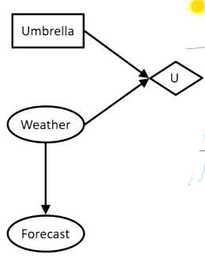
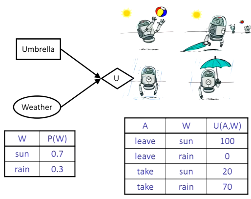
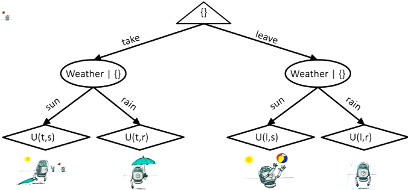
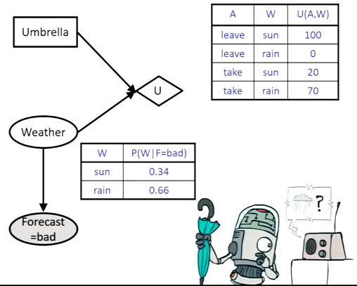
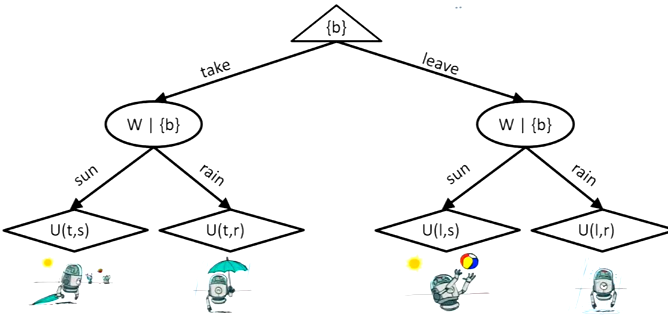
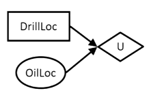
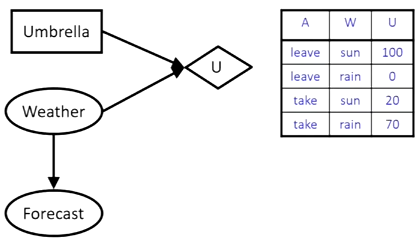

# Decision Networks and Value of Information

## Decision Networks

- On the top, we have a choice to take an umbrella or not
- On the bottom, we have a mini BN
- These 2 results turns into some outcome $U$
- We have 3 kinds of nodes
    - Circle: a chance node (like BN)
    - Rectangles: an action node (like observed evidence)
    - Utility: parents typically involve both action and chance nodes
        - The outcome node
- A DN's goal is to find the best action to take
    - Start off with all observed evidence
    - Go through every possible action
    - For each action, we calculate probabilities of other parent nodes
    - Calculate the expected utility for each action
    - Choose the highest utility-yielding action
- We now have a utility table: 
- Our action is whether to take the umbrella
- Suppose we leave umbrella at home
    - If it's sunny, I get $U=100$
    - If it rains, I get $U=0$
    - $\rArr EU(leave)=0.7\cdot100+0.3\cdot0=70$
- Suppose we take
    - $\rArr EU(take)=0.7\cdot20+0.3\cdot70=35$
- Optimal decision here is to leave the umbrella
- Equation: $MEU(\emptyset)=\max_a EU(a)=70$
    - $\emptyset$ represents evidence
- The arguments for finding max utility is evidence
    - The best action depends on what the current evidence is

### Outcome Trees

- We can also represent this problem with a tree
- Note that we have to compute the probabilities ourselves
    - In expectimax, it was given

- If we listen to the forecast, we get different weights/probabilities
    - $EU(leave|bad)=0.34\cdot100_0.66\cdot0=34$
    - $EU(take|bad)=0.34\cdot20+0.66\cdot70=43$
- Now the best action is to take
    - The only thing that changed was the weights
- Note that both utilities dropped
    - We forecasted a bad day
    - Therefore, both utilities will drop
    - We want to know the best one
- Equation: $MEU(F=bad)=\max_a EU(a|bad)=53$

- Chance nodes have no changed to depend on forecast

## Value of Perfect Information
- The idea is to hypothetically reveal the value of a variable
    - We check if utility goes up or not
    - If it does, yay
- Simple oil example: we want to drill for oil 
    - Suppose there are only 2 possible locations: $A$ and $B$
    - Suppose utility of getting oil is $k$ and not getting oil is $0$
        - Right now, we have an $EU=0.5\cdot k$ for both $A$ and $B$
    - What if the oil location is revealed?
        - We then get $k$ since we know where to drill
    - We now say the value of information $VP(OilLoc)=k/2$ since we gained $k/2$ in utility
- Weather example: 
    - Recall that the original optimal value was to leave the umbrella
        - $EU(leave)=70$
        - This is when we didn't have forecast
    - Action changed to take when forecast said it was bad weather
    - Note that $MEU(F=good)=95$
    - Revealing the forecast both increased and decreased our utilities
    - We need to reason how likely the forecast is to be good/bad
        - Depends on other evidence
        - Suppose $P(good)=0.59,P(bad)=0.41$
        - $\rArr 0.59\cdot(95-70)+0.41\cdot(53-70)=7.8$
- General definition
    - When we have some evidence $e$, we act accordingly
    - If we have new evidence $E'$, we may change actions
    - However, we don't know the exact value of $E'$, so we calculate expected value
    - The <u>value of information</u> is how much our utility changed based on $E'$
- Properties
    - Non-negativity: value of info can't be negative
    - Non-additive: $VPI(e,e')\not= VPI(e)+VPI(e')$
        - Ex: revealing both forecast and weather makes forecast redundant
    - Order-independent: the order of revealing variables doesn't matter
- Variable properties:
    - 0: a variable doesn't affect action
    - Low: the new action results in slightly higher utility
    - High: the new is significantly higher utility
- So far, we've assumed all value of information to be value of *perfect* information
    - This is because all info is perfect
    - If something is "noisy", it's not imperfect
    - It's a perfect reveal of that variable and a noisy reveal of related variables

## POMDPs
- POMDPs are partially observable MDPs
    - Don't know much about the world
    - But we can make observations
- We now have observations $O$
    - Observation function $P(o|s)$, or $O(s,o)$
    - We don't know what state we're in
- We just know what states we could be in and what observations we make
    - Think about RG and SLAM + LiDar
    - We track the evidence to have belief states
    - The more evidence we get, the more we can narrow down states
- To solve POMDPs, we can use expectimax
    - Figure out probabilities of states given some evidence
    - Goal is to minimize uncertainty of states
