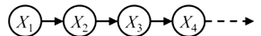
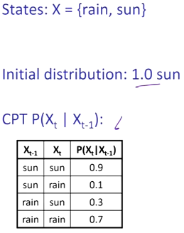
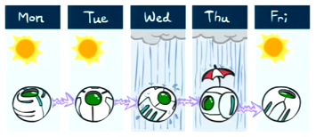
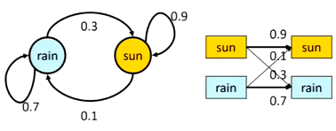
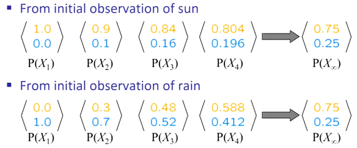
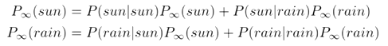
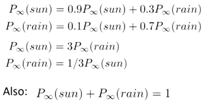

# Hidden Markov Models
- We often want to reason about a sequence of observations
    - Need to introduce concepts of time or space into our models

## Markov Chains

- The value of $X$ at a given time is called the <u>state</u>
    - Note that this a special kind of BN
- Parameters:
    - Initial: $P(x_1)$
    - Transition: $P(X_t|X_{t-1})$
        - Indicates how state changes over time
        - Also called dynamics of the model or the transition matrix
- This is a stationary assumption
    - Transition probabilities are the same across time
- This is the same as MDP transition model, just no actions
- Follows the first order Markov property
    - Past and future are independent given the present
    - Each time step only depends on the previous
- This model is just an infinitely growing BN
    - We can still use standard BN operations if we limit the length of the chain

### Example

- Suppose we have the following observations: 
- There are 2 other ways we can represent the CPT: 
- We have an initial distribution of $1.0 sun$
- After 1 step, we have $X_2=sun$
    - $P(X_2=sun)$
    - $=P(X_2=sun|X_1=sun)(X_1=sun)+P(x_2=sun|X_1=rain)P(X_1=rain)$
    - $=0.9\cdot1.0+0.3\cdot0.0=0.9$
- What about $P(X_t)$ for some $t$
    - $P(X_1)$ is known
    - $P(X_t)=\sum_{x_{t-1}}P(x_{t-1},x_t)$
    - $P(X_t)=\sum_{x_{t-1}}P(x_t|x_{t-1})P(x_{t-1})$
- We can recursively figure out an outcome after $t$ time
- This is known as the <u>mini-forward algorithm</u>
- Running this for a long time in this example gives us: 
    - Initial values don't matter for future down the road
    - What matters is the CPT

## Stationary Distributions
-  Influence of the initial distribution usually gets less and less over time
    - The distribution we end up with is independent of how we started
    - This distribution is called the stationary distribution $P_\infin$
- Equation: $P_\infin(X)=P_{\infin+1}(X)=\sum_xP(X|x)P_\infin(x)$

### Example
- Reuse rain/sun model
- We currently have these 2 equations to solve: 
    - Note that $P_\infin$ are the unknowns, and the others can be derived from the table
    - Solution: 
    - $\rArr P_\infin(sun)=3/4$
    - $\rArr P_\infin(rain)=1/4$
    - Note that this matches the converged values

## Hidden Markov Models (HMM)
- Hidden Markov Models can't observe states
    - Instead, we look at evidence
    - Try to infer the posterior distribution
- Alternate between time passing and measurements of evidence
    - Eventually, the distribution starts to converge
- Properties:
    - In HMM, the future does depend on past via the present
    - Current observation is independent of all else given current state
    - Note that evidence nodes are not guaranteed to be independent
- Filtering/monitoring is the task of tracking beliefs over time
    - Start with initial setting $B_1(X)$
    - As time passes or we get more observations, we update $B(X)$
    - Distribution: $B_t(X)=P_t(X_t|e_1,...,e_t)$
- An application is like LiDar and HMM
    - Doesn't know where it is at first
    - As it makes observations, it updates beliefs and narrows down the distribution
    - Eventually, it will know where it is with high probability
- To find $P(X_1|e_1)$:
    - $P(x_1|e_1)$
    - $=P(x_1,e_1)/P(e_1)$
    - $\propto_{X_1}P(x_1,e_1)$ <small>we only care about parts that deal with $X_1$</small>
    - $=P(x_1)P(e_1|x_1)$
- Essentially, we calculate the probabilities
    - Then we normalize since the calculations are only proportional
- Another base case is $P(X_2)$
    - This is just $\sum_{x_1}P(x_1)P(x_2|x_1)$
