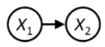
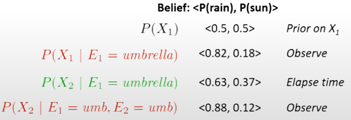
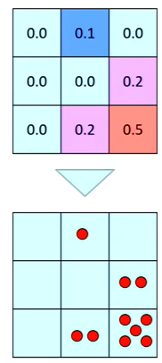

# Particle Filtering
- We have 2 base cases to use for beliefs
    - Time
    - Evidence
- As time passes, we have to predict what the next time step looks like
- When we observe something, we also need to reshape the belief distribution

## Base Case: Time

- We assume we know $P(X_1)$
    - From this, we can find $P(X_2)$
    - $\rArr P(X_2)=\sum_{x_1}P(x_1,x_2)$ <small>(normal probability marginalization)</small>
    - $\rArr P(X_2)=\sum_{x_1}P(x_1)P(x_2|x_1)$
- When we have $X_2$, we can calculate the probability of what $X_1$ was
    - Consider all possible $X_1$ starting values, and use the probabilities to find probability of a certain $X_2$
- We currently have the belief $P(X|evidence)$
    - $\rArr B(X_t)=P(X_t|e_{1:t})$
- After 1 time step, we know want to know the new belief
    - $P(X_{t+1}|e_{1:t})$
    - We still have the same evidence
- Final equation: $=\sum_{x_t}P(X_{t+1}|x_t)P(x_t|e_{1:t})$
    - We consider all possible $x_t$ "origins" and sum them up
- Compact: $B'(X_{t+1})=\sum_{x_t}P(X_{t+1}|x_t)B(x_t)$
- Time alone is enough to generate uncertainty
    - We only know where $X_t$ is
    - For $X_{t+1}$, we only know where it *could* go
- However, it depends on the model
    - If we know that a ghost has a tendency to approach the corner, then after a long time we're more certain it's in the corner

## Base Case: Observation
- Here, time doesn't pass
- We still know $P(X_1)$
- The idea is to figure out how new evidence reshapes our evidence
    - Ex: we observe we're near a well
    - Now we're certain we're not in the middle of the room
- To find $P(X_1|e_1)$:
    - $P(x_1|e_1)$
    - $=P(x_1,e_1)/P(e_1)$: <small>standard probability rule</small>
    - $\propto_{X_1}P(x_1,e_1)$: <small>we only care about parts that deal with $X_1$</small>
    - $=P(x_1)P(e_1|x_1)$: <small>every probability is now weighted by the probability of evidence</small>
- We currently have the belief $P(X|evidence)$
    - $\rArr B'(X_{t+1})=P(X_{t+1}|e_{1:t})$
- Final equation: $=P(e_{t+1}|X_{t+1})P(X_{t+1}|E_{1:t})$
    - Left side is what's computed
    - Right side is already known as $B'(X_{t+1})$
- Compact: $B(X_{t+1}) \propto_{X_{t+1}} P(e_{t+1}|X_{t+1})B'(X_{t+1})$
- The idea is that beliefs are re-weighted by likelihood of evidence
    - Unlike time, we also need to re-normalize
- Generally speaking, the more evidence we get, the more certainty we have
    - Sometimes it can be more confusing if an unlikely evidence happened
    - However, overall it decreases uncertainty

## Filtering
- There are 2 actions we can take
    - Let time elapse
    - Observe
- We start off with some generic belief
    - As we observe and let time elapse, we update it
- Example: 
    - We start off with a general belief
    - We observe there's an umbrella, meaning it's likely to rain
    - After time passes, we're less sure
    - We observe umbrella again, so rainy is more likely again
- The idea of particle filtering is to track samples and hypotheses
    - Particle filtering is well suited to large space problems
    - Provides an approx inference
- General process
    - Instead of tracking the entire distribution, we track samples of $X$
    - These samples are called particles
    - What we store is a list of particles, not all possible states
- Example: 
    - Here, our particles match the distribution
- Suppose we store $N$ particles to represent $P(X)$
    - Normally $N$ is way smaller than the size of $X$
- $P(x)$ is approximated based on how many particles have the value $x$
    - More particles = better accuracy
    - So far, all particles have weight 1

### Elapse Time
- To let time elapse, we sample the next position based on transition model
    - $x'=sample(P(X'|x))$
    - Similar to the CS students problem, where sample frequency reflects probabilities
- Each particle is individually updated

### Observation
- After observing some evidence, we ask each particle whether they expected this evidence
    - If a particle expected this evidence, it gets a higher weight
    - Otherwise, it gets a lower weight
    - $\rArr w(x)=P(e|x)$
- Our list of $N$ particles still keeps every sample, they're just now shrunk based on their expectations
    - $B(X)\propto P(e|X)B'(X)$

### Resample
- We now take the weighted particles and resample from the last
    - Highly weighted particles will now show up more often
    - Lower weighted particles will show less or even none at all
    - Weights are also removed now
- This process is equivalent to re-normalizing

### Summary
- We're tracking samples of states instead of an explicit distribution
- General process
    - We start off with some particles and hypotheses
    - We then move these particles around based on transition model
    - Once we get evidence, we weight these particles
    - Resample based on the previous weights
- Moving particles around represents elapse time
- Weighting and resampling represents observations

## Dynamic BN
- These BN have multiple variables with multiple sources of evidence
    - Imagine you're tracking 2 ghosts
    - You have 2 different sonar readings for each one
- Idea is to repeat a fixed BN each time
- A generalization of HMM
