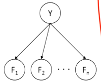
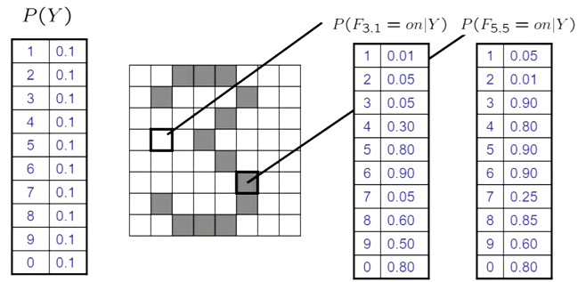
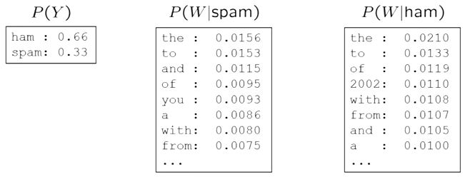
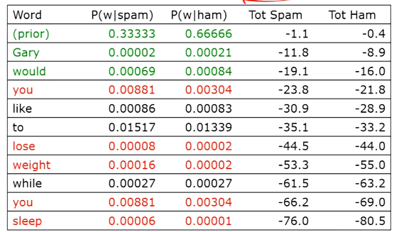
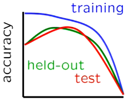

# ML: Naive Bayes
- Instead of basing model on errors (like RL), we're building a model from sample data
    - Run inference on this to make inferences
- The model has input data and output label as random variables
    - Query for label distribution based on input features
- Challenges
    - What structure should BN have
    - How do we learn the parameters?
- We make a radical assumption that all features are independent of the label: 
- Simple digit recognition:
    - Split up the images/L15/image into grids, where $F_{ij}$ corresponds to a grid being "on" or "off"
    - The feature vector will have $\langle F_{0.0},F_{0.1},...,F_{15.15}\rangle$
    - A digit (like 1) will correspond to its own feature vector
- What we want to find is probability of a number being a certain digit given the feature vector
    - $P(Y|F_{0.0},...,F_{15.15})\propto P(Y)\prod_{i,j}P(F_{i,j}|Y)$
    - The overall probability breaks down into a bunch of feature probabilities
- General equation: $P(Y,F_1,...,F_n)=P(Y)\prod_iP(F_i|Y)$
    - We have $n\cdot|F|\cdot|Y|$ parameters and $|Y|\cdot|F|^n$ values
    - Total parameters is linear in $n$
    - This equation will give us a vector of probabilities for each $y$ in $Y$
- We need data to be able to use the Naive BN
    - Need to figure out prior probabilities for labels
    - Compute a bunch of probability tables for each feature

## Examples
### Digit

- Right now, we say that every number is equally likely
    - It could be different based on what data we're working with
    - Ex: round numbers $\rArr$ more 0's showing up
- We then have a bunch of distributions for each pixel
    - Indicates probability of each digit given that the pixel is on

### Text
- In text, the features are the words and the random variable is the position
    - This results in a huge grid since:
        - Document can be any length
        - Lots of possible words at a certain position
    - However, we don't have to worry about this
- Text models make another assumption in that words are identically distributed
    - Basically, the positions of words don't really matter
    - Distribution of word $w$ at position $x$ is the same at position $y$
- A "bag of words" concept
    - We just look at histograms of words
- Given the probability of a class and the conditional frequencies of a word, we accumulate probabilities as words come in

 
- We take the log of the products
    - Otherwise, it'll get small super fast
- As words come in, we accumulate the product
    - Similar to belief updates
    - These small weak bits of evidence slowly builds up to the result

## Training and Testing
- The basic principle of ML is empirical risk minimization
    - Want to find the best model for something
- We don't know what the real world's distribution is like
- However, we have a training set that we assume is close to the real world
- The main risk is overfitting
    - We do a super good job on the training data
    - However, we don't generalize enough to do well in the real world
- We need good and enough training data
- General process
    - Experimentation: training the data
    - Evaluation: check accuracy
        - Actually want utility since different mistakes have different levels of damage (ex: spam in your inbox is not as bad as important email going to spam)
- A problem to avoid is overfitting
    - We do super good on training data, but end up failing in real world
    - One thing is to look at probabilities
- We can't use raw probabilities since it'll overfit    
    - Ex: Suppose a word appeared once in spam and none in ham
    - The presence of that word will completely swing the product to spam (since ham will be multiplied by 0)
    - In reality, that word is insignificant
- To do better, we need to smooth and estimate

### Parameter Estimation
- How to estimate distribution of a random variable?
    - Elicitation: ask a human or another source
    - Empirically: $count/total$ will give estimate
- This is called maximum likelihood
    - We want the one that matches the data the best
    - Given the data, which parameters are most likely
- $\theta_{map}=\argmax_\theta P(X|\theta)P(\theta)$

### Smoothing
- We need some way to account for unseen events
    - Just because we've seen event $X$ every time, doesn't mean $Y$ won't eventually happen
- Laplace's estimate is to assume we saw each outcome one more than we did
    - Gets rid of 0s
    - $P_{LAP}=\frac{c(x)+1}{N+|X|}$
- Ex: $\{r,r,b\}$
    - Normal: $P(r)=2/3,P(b)=1/3$
    - Laplace: $P(r)=3/5,P(b)=2/5$
- A more extended form is we saw it $k$ times more
    - $P_{LAP,k}=\frac{c(x)+k}{N+k|X|}$
    - We can adjust $k$, which is called the strength of the prior
    - Higher $k$ is less fit, lower $k$ is more fit
- Smoothing is critical for real classification problems
- The idea of tuning is to know what to set $k$ to 
