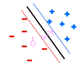

# ML: Perceptrons
- Similar to BN, we want to classify something based on features
    - However, we don't care about full probabilistic model
    - We're just going from features to class
    - Cares about the decision

## Linear Classifiers
- Inputs are feature values
- Each feature has a weight
- The <u>activation</u> is the weighted sum
    - $activation(x)=\sum_iw_i\cdot f_i(s)$
    - Shorthand is $w\cdot f(x)$ where it's the dot product between vectors $w$ and $f$

### Weights
- Weights can be anything
    - Positive, negative, integer, decimal
    - In learning, we figure out the weight vector
- If activation is positive/negative, we output $\pm 1$ 
- We use vector geometry to determine the outcome 
    - $x_1$ lines up with $w$, so it's positive, which means spam
    - $x_2$ does not, so it's negative, and therefore ham
- Essentially, we draw the orthogonal (perpindicular) line to $w$ 
    - Any vector to the left of the line is positive
    - To the right is negative
- Changing $w$ will change the decision process

### Decision Rules
- For a binary decision rule:
    - Examples are points
    - Any weight vector has a hyperplane
- Consider the example where $free=4$, $money=2$:
    - If $bias$ was 0, then the hyperplane (orthogonal) would be through $(0,0)$ 
        - Right would be positive
        - Left would be negative
    - However, the bias is $-3$, favoring the negative side 
- Final result: 
- For *binary* decision rules, outcomes can only have 1 of 2 sides
    - Either +1 or -1

### Weight Updates
- Sometimes we don't know the weights $w$ and need to learn them
    - We start off with weights all being 0
    - We go through all the data and classify
        - If classification was correct, then no need to change
        - Otherwise, we need to somehow adjust the weight vector
    - Repeat until we finally have a set of weights that work
- Start off with initial weighting
    - We take the weight vector $w$ and feature vector $f$ and compute the dot product to get $y$
    - We compare $y$ with the correct label $y^*$
    - If $y=y*$, we're chilling
- If $y\not = y^*$, we need to change $y$ to match $y^*$
    - We can't change $f$ since it's the input
    - That leaves us with changing $w$
- We want $w$ to be "less aligned" with $f$
    - $w'=w+y^*\cdot f$
    - In other words, we want it to be aligned with the negative of $f$ 
- Proof:
    - $w'\cdot f = (w+y^*\cdot f)\cdot f$
    - $=w\cdot f + y^*\cdot f \cdot f$
    - The left term is the original
    - The right term is the correction amount
- We use learning rates to control how much we can correct at a time

## Multiclass Perceptron

- For binary perceptrons, we've only covered the separable case
    - There does exist some hyperplane that can divide the points: 
- In multiclass, there are multiple classes for data
    - We have a weight vector $w_y$ for each class $y$ 
    - The activation of some class $y$ is $w_y\cdot f(x)$
    - The decision comes from the highest activation: $y=\argmax_y w_y\cdot f(x)$
- Similar to binary, we start off with 0 weights
    - We find $y$ and compare to $y^*$
- If they're different, then we lower score of wrong answer, raise for higher
    - $w_y=w_y-f(x)$
    - $w_{y^*}=w_{y^*}+f(x)$ 
- The idea here is to rotate so $w_{y^*}$ has a higher inner product with $f$ than $w_y$
    - We want higher because of the $\argmax$ 
- Proof
    - $w'_y\cdot f(x)=(w_y\cdot f9(x)) \cdot f(x)$
    - $= w_y\cdot f(x)-f(x)\cdot f(x)$
    - Left term is is original, right term is correction amount
    - We now result in a lower dot product by $f\cdot f$
    - For $w'_{y^*}$, it would be + instead of -

### Example

#### "*win the vote*"
- The vector would be $f=\langle 1,1,0,1,1 \rangle$
    - $w_{S} \cdot f=1$
    - $w_{P} \cdot f=0$
    - $w_{T} \cdot f=0$
- We would classify as sports, but we want politics
    - Subtract $f$ from $w_{S}$ and add to $w_{P}$
    - $\rArr w'_S=\langle 0,-1,0,-1,-1 \rangle$
    - $\rArr w'_P=\langle 1,1,0,1,1 \rangle$

#### "*win the election*"
- $f=\langle 1,1,0,0,1 \rangle$
    - $w_{S} \cdot f=-3$
    - $w_{P} \cdot f=3$
    - $w_{T} \cdot f=0$
- We classify as politics correct
- This is correct so we move on

#### "*win the game"*
- $f=\langle 1,1,1,0,1 \rangle$
    - $w_{S} \cdot f=-3$
    - $w_{P} \cdot f=3$
    - $w_{T} \cdot f=0$
- We classify as politics, but it should be sports
    - $w'_P=w_P-f=\langle 0,0,-1,1,0 \rangle$
    - $w'_S=w_S+f=\langle 0,0,1,-1,0 \rangle$

#### Repeat
- We continue to cycle until we no longer make mistakes

## Perceptron Analysis
### Properties
- Data is separable if there exists a hyperplane that can separate data (binary case)
    - For multiclass, if there exists a set of vectors where the dot product correctly points
- A perceptron algorithm has convergence if it eventually converges
    - This is not guaranteed
    - Some perceptrons can bounce back and forth without ending
    - Binary perceptrons with separable data are guaranteed to convergence
- The mistake bound is max \# of mistakes related to degree of separabilitiy
    - $mistakes<\frac{k}{\delta^2}$
    - $k$ is size of feature vector $f$
    - $\delta$ is separability measure
        - Think about a line that splits two classes
        - $\delta$ is how much room that line can shift and still hold 
    - If $\delta$ is non-zero, then the perceptron makes a finite amount of mistakes before converging
    - The larger $\delta$ is, the faster it converges

### Problems
- If data isn't separable, weights will keep bouncing back and forth
    - Every new data point will result in some correction
    - A solution is to average weight vectors over time
- Perceptrons can stop even if the solution sucks
    - Could be a solution that barely touches the edge of a class
    - Want to build in some error room 
- Overtraining/overfitting
    - This is easy to solve
    - We have a separate set of held-out data and monitor its accuracy
    - Once the accuracy peaks, we stop training 
    - Otherwise we start to memorize the training data

## Logistic Regression

- Suppose we have a non-separable case where every possible solution will make at least one mistake
    - Attempting to perfectly fit this data will result in overfitting
- A solution is to switch from classification to probabilities 
    - The line indicates a 50/50 chance for A vs B
    - As you move away from the line, the probabilities change depending on direction
    - This allows mistakes since that red has a non-zero probability
    - This approach will still converge on a solution
- We originally have some score $z=w\cdot f(x)$ that has a range of $(-\infin, \infin)$
    - We want to convert this into a number between $[0,1]$ to represent probability
    - If $z$ is very negative, we want closer to 0
    - If $z$ is very positive, we want closer to 1
- The solution is the sigmoid function
    - $\sigma(z)=\frac{1}{1+e^{-z}}$
    - Visual representation: 

### Binary
- We now want to find the best $w$
- We can use max likelihood estimation:  
    - Drops the distributions
    - Focuses on the decisions
- This algorithm also helps with finding good hyperplanes
    - Solutions that are borderline will get lower scores

### Multiclass
- Same idea applies to multiclass
- Multiclass sigmoid: 
    - Note that the 3 terms will add to 1 since we divide by the sum
    - The terms will also have proportional probabilities
        - If $z_1>z_2$, then $e^{z_1}>>e^{z_2}$ since exponential growth
    - These terms are called <u>softmax activations</u>
- Similar max likelihood estimation formula  
