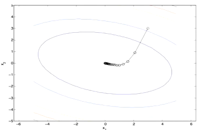

# ML: Optimization and Neural Networks
## Optimization
- We have the formula to determine the best $w$
    - Now we need to figure out *how* to find the best $w$
    - Not feasible to explore infinite possibilities for $w$
- One simple approach is to treat it like a CSP
    - Remember that CSP is where we need to find some optimal assignment (like map coloring)
    - We start with a random assignment and generate random permutations
    - If it's better, keep it; otherwise try again
- The problem with this approach is we have a continuous, not discrete domain
    - There are infinite possible values for each $w$ entry
- A benefit of continuity is we can figure out what direction to make changes in
    - With discrete, we have no way of telling which ones are more likely to be better

### 1D Optimization

- If we have some function, we can just plot it across the infinite spectrum
    - Use graph theory to find the maximum and find $w^*$ from that
    - However, this approach isn't useful
    - We want to use something that can also be applied to higher dimension problems
- We can move to the left and right and step in best direction
    - Suppose we start at $w_0$
    - Compare $g(w_0+h)$ and $g(w_0-h)$
    - We see moving right goes higher so we step in that direction
- We don't have to find the global maxima
    - A local max is good enough
    - We can also randomize several $w_0$ points and see if there's any other local max that's better
- We can also just use the derivative
    - Use the slope to figure out which direction to step
    - 0 derivative means a peak, meaning no more possible improvements

### 2D Optimization

- Note the circles on the bottom
    - These are called contours
    - They indicate the height of the function at any point along the ring
    - We can use the contours alone to find the highest values
- Same as 1D, we can find the slope for each coordinate
    - The steeper the slope, the bigger the step
    - Steeper = more promising = more effort should be put in
- Example $g(w_1,w_2)$
    - $w_1\larr w_1+\alpha \cdot \frac{\delta_g}{\delta_{w_1}}(w_1,w_2)$
    - $w_2\larr w_2+\alpha \cdot \frac{\delta_g}{\delta_{w_2}}(w_1,w_2)$
    - Think of it like "walking" up the hill from each direction 
- Weight vector updating: $w \larr w+\alpha\cdot\nabla_w g(w)$
    - $\nabla_w g(w)=\langle \frac{\delta_g}{\delta_{w_1}}(w), \frac{\delta_g}{\delta_{w_2}}(w) \rangle$
    - The $\nabla$ is just a vector containing all the partial derivatives for each coordinate
- Contour visualization: 
    - One reason for smaller steps could be decaying learning rate $\alpha$
    - Another is that we're approaching the top and we're getting smaller derivatives

### Steepest Direction
- Rather than going coordinate by coordinate, what if we just go in the steepest direction: 
    - $w$ is our current position
    - $\Delta$ is how far we move
    - $\Delta_1^2 + \Delta_2^2$ is cause $dist=\sqrt{\Delta_1^2+\Delta_2^2}$
    - $\epsilon$ is to create a "circle" boundary on how far we can step 
- We assume that we can only make a small $\Delta$ change
    - We can use Taylor's Expansion to approximate to linear: 
    - We can ignore $g(w)$ term since it doesn't contain $\Delta$
- To find the steepest ascent direction: 
- The final solution: $\delta = \epsilon \frac{\nabla_g}{||\nabla_g||}$
    - Remember $||v||=\sqrt{v_1^2+v_2^2+...+v_n^2}$
- This indicates that derivatives already point us to the steepest direction
    - Gradient direction = steepest direction

### N-dimensions
- We just apply this procedure to all variables: 
- Algorithm: 
    - Learning rate $\alpha$ will need to be tweaked
    - General rule of thumb: only change $w$ by 0.1-1% each time
- Adding log likelihood, which is called batch gradient: 
    - Note that gradient of a sum is the sum of the gradients
- We can also use stochastic gradients: 
    - Idea is to not wait for all gradients to be calculated before moving
    - For each data point, calculate and move
    - At the next data point, we'll be in a better place
- In reality, we combine the 2 thanks to parallel computing
    - We split the whole thing into a small batch and compute gradients
    - Corresponds to how much parallel computations you can do
        - Ex: 100 parallel computations = batch of 100
    - This is called mini-batch gradient

## Neural Networks

- Multiclass logistic regression is a type of neural network
    - We have features $f(x)$
    - The edges from $f$ to $z$ represent weights
    - We get an initial result $z$
    - We use softmax to convert this number into a probability
- The task is to figure out how to get the features
    - We use a deep neural network in the beginning
- Digit recognition example:
    - Features could be number loops, which pixels are on/off, etc.
    - We start off with a vector of each individual pixel
    - We use learning to figure out how to change pixels into features
- Each node is a neuron, which does a calculation: 
    - Weighted sum of inputs to compute activation
    - Uses neurons from the previous layer $k-1$
    - $g$ is a non-linear rescaling factor
- Layers don't need the same number of neurons as each other
    - Can be as flexible and chaotic as needed
- Common activation functions: 
    - Sigmoid is useful for probabilities
    - Hyperbolic performs a little better with things naturally centering around 0
    - ReLU is very fast, but simple
- Training is the same as logistic regression 
    - $w$ is just a much larger vector
    - Once log likelihood of hold-out data starts to decrease, stop
- Properties
    - As long as a simple 2-layer NN has enough neurons, it can approximate any continuos function
    - NN can be seen as learning the features
    - Too many neurons can be overfitting
- To compute derivatives, we only have a tables for simple functions like exponents and sine/cosine 
    - Our NN is not in this table
- We can use the chain rule to calculate the derivative of our NN
    - If $f(x)=g(h(x))$, then $f'(x)=g'(h(x))\cdot h'(x)$
    - We apply this chain rule over and over
    - These are well-defined tools, we so can use programs to compute it for us
- Applications
    - Computer vision
    - Speech recognition
    - Language translation
