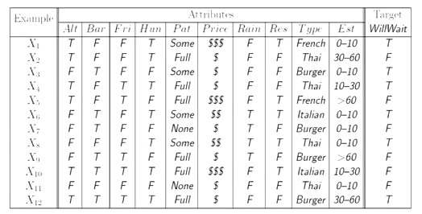
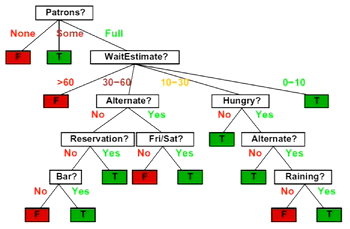
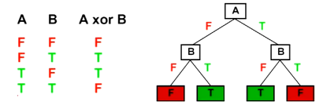

# NN and Decision Trees
## Inductive Learning
- The idea is to learn a function from examples
- We have a target function $g$
- We have input/output pairs $(x,g(x))$
    - $x$ is email, $g(x)$ is spam/ham
    - $x$ is house, $g(x)$ is selling price
- We don't know $g$ so we have to learn it from samples
    - We have a hypothesis space $H$
    - We find a hypothesis function $h(x)$ that is close enough to $g$
- Includes both classification (labels) and regression (real numbers)

### Consistency vs Simplicity
- Trade off lies between consistency and simplicity
    - Simple functions tend to fit trends better
    - Consistency involves hitting more of the data points
- Basically bias vs variance
    - Bias is how accurate it is
    - Variance is how good does training set results predict real test results
- Most algorithms go for consistency, or low bias
    - Reduce the hypothesis space
        - Make more assumptions
        - Have fewer, but better features
        - Limit size of NN
    - Regularization
        - Smoothing via small increments
        - Avoids special cases, or the outskirts of $H$

## Decision Trees
- Another structure to use
    - Along with BN, NN, and Logistical Regression
- Suppose we want to predict if someone is willing to wait to be seated at a restaraunt
- We have this truth table: 
- We get the resulting decision tree: 
    - We go down the tree based on the input
    - Helps refine how many things we need to know before coming to a decision
    - We can also add probability nodes (ex: 70% likely to wait)
    - This tree is basically $h(x)$ where $x$ is the feature vector
- A nice thing about DTs is their expressiveness
    - Can express any function of the features: 
    - We want to aim for compact trees
- Trees are generally better than tables
    - Tables include every possible situation
    - Trees only include situations with the relevant input
    - Easier to find patterns
- Another benefit is that trees automatically combine different effects into one
    - BNs and perceptrons need to create a separate node for the conjoiner
    - Ex: $A$ and $B$ would need a third node $A\land B$, but the tree deals with internally

### Hypothesis Spaces
- Suppose we have $n$ Boolean attributes
    - We have $2^n$ rows
    - Total of $2^{rows}$ different trees
    - 6 attributes will be 18 *quintillion* trees
- Suppose we only want stumps, or trees with depth = 1
    - $n$ choices for an attribute
    - 2 rows for that attribute
    - Each row is T/F
    - Total is $4n$, which is way smaller
- Hypothesis space determines how good our functions are
    - A more expressive hypothesis state leads to lower bias, but higher variance
- 
