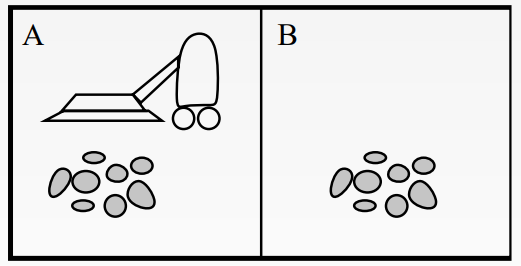
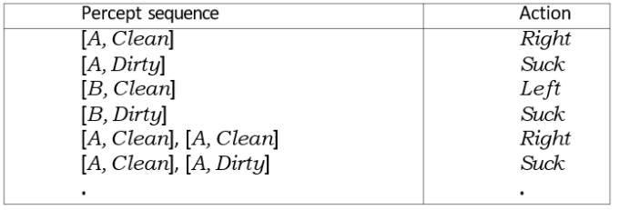
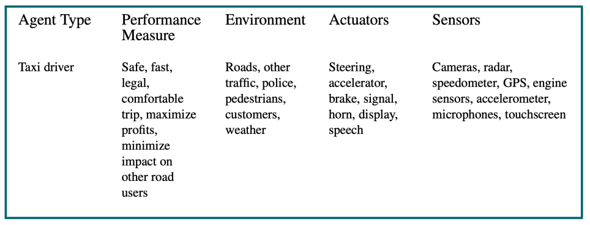
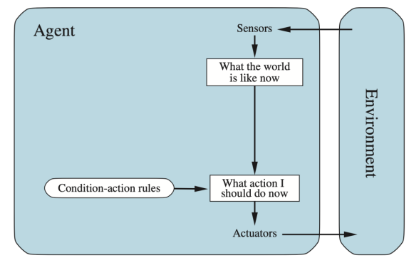
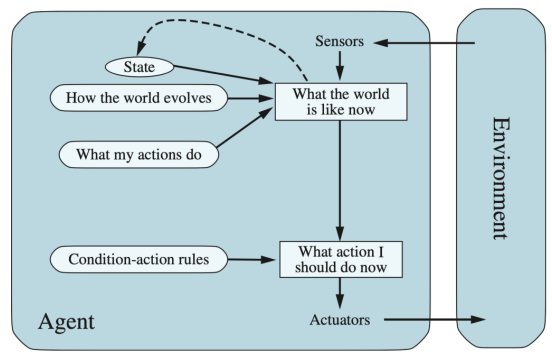
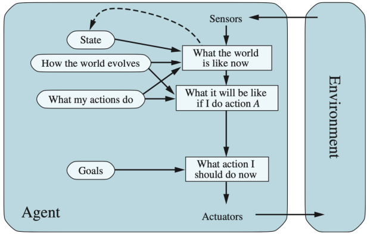
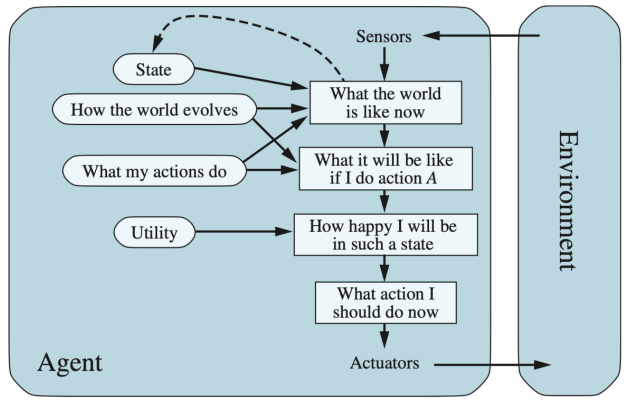
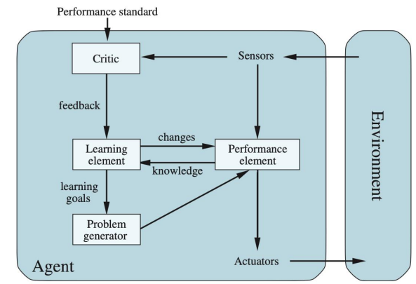

# Agents

## Agents and Environments
- <u>Agent:</u> a computer program expected to be intelligent
  - Receives information from the environment via <u>sensors</u> as <u>percepts</u>
  - Uses this info to control <u>actuators</u>, which perform <u>actions</u> on the environment
- Example: Vacuum world<br>
  - Percepts: `[location, status]` (ex. `[A, Dirty]`)
  - Actions: `Left`, `Right`, `Suck`, `NoOp`
- An agent's behavior is described by the <u>agent function</u>
  - Input: percept sequence
  - Output: agent's response to any sequence of percepts
  - Example<br>
- An <u>agent program</u> is a concrete implementation of the agent function
  - Runs on some machines (a physical system)
  - Depends on:
    - Machines (physical resource limit)
    - Program (how well it's written)
    - Example:
        ```
        function Reflex-Vacuum-Agent([location,status]) -> returns an action
            if status = Dirty then return Suck
            else if location = A then return Right
            else if location = B then return Left
        ```

## Rationality
- <u>Rationality</u> is a fixed performance measure that evaluates the env sequence
  - 1pt per square cleaned in time T?
  - 1pt per square per time step, -1pt per move?
  - Penalize for >k dirty squares?
- A <u>rational</u> agent chooses whichever action maxes the expected value of the performance measure given the percept sequence so far
  - Percepts may not supply all necessary information
  - Action outcomes may not be as expected
    - Rational ≠ successful
    - Rational = exploration, learning, autonomy

### Rational Agent
- Selects an action to maximze its expected value (or <u>utility</u>)
  - Based on initial knowledge
  - Learns from what it perceives
- The <u>utility function</u> is an internal performance measure
- Succeeds in a variety of different environments
- Should be autonomous
- Being rational means maximizing the expected utility

## PEAS
- <u>PEAS</u>: *Performance measure, Environment, Actuators, Sensors*
- We can use PEAS to design a rational agent
  - Must specify the task environment
- Taxi example<br>
- Pac-Man bot example
  - Performance measure
    - -1 per step
    - +10 per food
    - +/-500 for win/die
    - +200 scare ghost
  - Environment: pacman dynamics
  - Actuators: up, down, left, right
  - Sensors: entire state is visible (except for power pellet duration)

## Environment Properties
- Some properties of task envs
  - Full vs partial vs no observability
  - Single vs multi agent
  - Deterministic vs stochastic (random)
  - Episodic (events are unrelated) vs sequential (related)
  - Static vs dynamic
  - Discrete (checker) vs continuous (self-driving car)
  - Known vs unknown
- Task env properties have a big impact on agent design
  - Observability: agents need memory (internal state)
  - Stochastic: there can be contingencies
  - Multi-agent: need random behavior
  - Unknown physics: need to explore

## Agent types
- There are 4 major types of agents
  1. Simple reflex
  2. Model-based
  3. Goal-based
  4. Utility-based
- All of these types can be turned into <u>learning agents</u>
- An env and the agents that resign within it create a <u>world</u>

### Simple Reflex Agent


- Has direct input and output for data

### Model-Based Agent


- Stores internal state info
  - Keeps track of state of world

### Goal-Based Agent


- Extension of the model-based agent
- Wants to achieve its goals

### Utility-Based


- Extension of the model-based agent
- Wants to improve utility function
- Different agents are compared to see who has highest points

### General Learning Agent


- Adapts to previous experience and data

## Summary
- An agent interacts with an env through sensors and actuators
- The agent function describes that an agent does in all circumstances
- Agent programs implement (some) agent functions, running on a machine
- The performance measure evaluates the env sequence
- A rational agent chooses actions that maximize expected utility
- PEAS descriptions define task environments
  - Precise PEAS specs are essential
  - Strongly influences agent designs
- More difficult envs require more complex agent designs
  - More sophsticiated representations
- The types of agents: reflex, model-based, goal-based, utility-based
  - All turn into learning agents 
