# Searches

## Problem-solving Agent
- A <u>problem-solving agent</u> is an agent that plans ahead
    - Understands problem
    - Formulates goal
    - Finds solutions
    ```C
    function Simple-Problem-Solving-Agent( percept) returns an action
        static: seq, an action sequence, initially empty
            state, some description of the current world state
            goal, a goal, initially null
            problem, a problem formulation
    state ← Update-State(state, percept)
    if seq is empty then
        goal← Formulat e-Goa l(state)
        problem← Formulat e-Problem(state, goal) seq←
        Search( problem)
    action ←Recommendation(seq,state) seq←
    Remainder(seq,state)
    return action
    ```
- Uses atomic representation
    - States of the world are considered as whole
    - No internal structure visible to problem-solving algorithms
- Uninformed algorithms
    - Agents are unable to estimate how far it is from the goal
- <u>Offline problem solving:</u> acts with complete knowledge of the problem's input

## Search Problems
- Example would be path searching (like route finding or tour planning)
- General structure
    - A state space: set $S$
    - Initial state: $s$
    - Goal state: $s'$
    - Actions for $s$: set $A$
    - Transition model: $Result(s,a)$
    - Action cost function: $ActionCost(s,a,s')$
- A <u>solution</u> is a sequence of actions (called a <u>path</u>) from the initial state to a goal state
- An <u>optimal solution</u> has the *lowest* path cost among all solutions
    - Gets cost function as close to 0 as possible
- Example: 8-puzzle 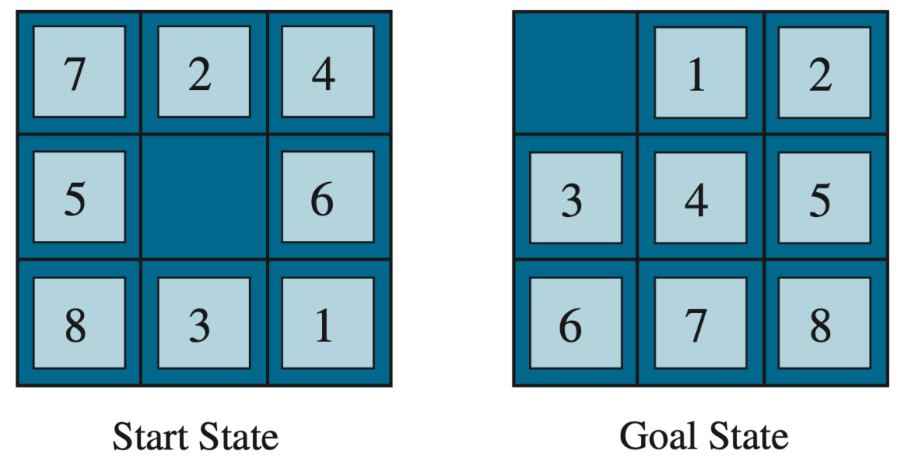
    - States: integer locations of the tiles
    - Actions: move blank up/down/left/right
    - Goal test: have we reached the goal state?
    - Action cost: 1 unit per move

### State Space Graphs
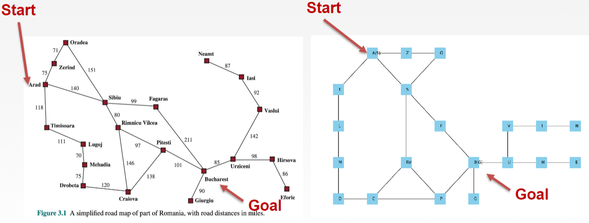
- Start in Arad and want to go to Bucharest
- We can convert this graph into a <u>state space graph</u>
    - A mathematical representation of a search problem
        - Nodes are world configurations (abstracted)
        - Edges (lines/arcs) represent successors (action results)
        - The goal test is a set of goal nodes
    - In a search graph, each state only occurs once
- A <u>search tree</u> can be used to find a solution
    - Each node corresponds to a state in the state space
    - Root node is the start state
    - Each edge is a corresponding action
    - Children nodes correspond to successors
    - Each node encodes an entire path and correspond to plans to achieve that state
- When searching, we lay a search tree over the state space graph<br>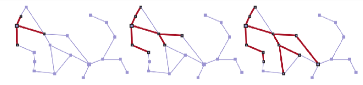
    - Input: search problem
    - Output: solution or indication of failure

### Best-first Search
- The <u>best-first search</u> is an algorithm that decides which node to expand to next
    - Uses a priority *queue*
- Utilizes an <u>evaluation function</u> $f(n)$
    - Select the node with lowest $f(n)$ value
    - Each node represents a path to the goal

## Uninformed Search Methods
- [Algorithm visualization tool](https://aimacode.github.io/aima-javascript/3-Solving-Problems-By-Searching)
- An <u>uninformed search method</u> only has access to info available in problem def
- No clue about how close a state is to the goal(s)
- Also called "blind search" or "unguided search"
- A class of general purpose search algorithms that operate in a brute-force way
- There are several factors to an algorithm's performance
    - Completeness: does it guarantee to find a solution (if it exists)
    - Cost optimality: does it find lowest path cost solution
    - Time complexity: # operations to find solution
    - Space complexity: amount of memory needed to find solution
- Time and space complexity are measured in terms of
    - $b$: max branching factor of search tree
    - $d$: depth of the shallowest goal node
    - $m$: max length of any pace in the state space (potentially $\infty$)

### Breadth-First Search
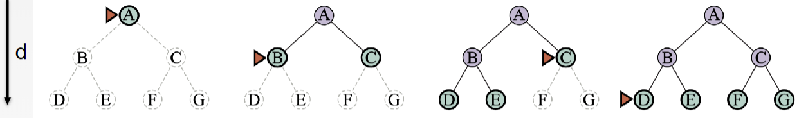
- All actions have the same cost
- Uses a FIFO queue (normal queue)
- Goes through each node in a level before going to the next level

| Criteria | Result |
|-|-|
|Completeness|Yes|
|Cost optimal|Only if all costs are the same|
|Time complexity| $O(b^d)$ <small>($1+b+b^2+b^3+...+b^d$)</small>|
|Space complexity|$O(b^d)$ <small>(keeps every node in memory)</small>|

### Depth-First Search
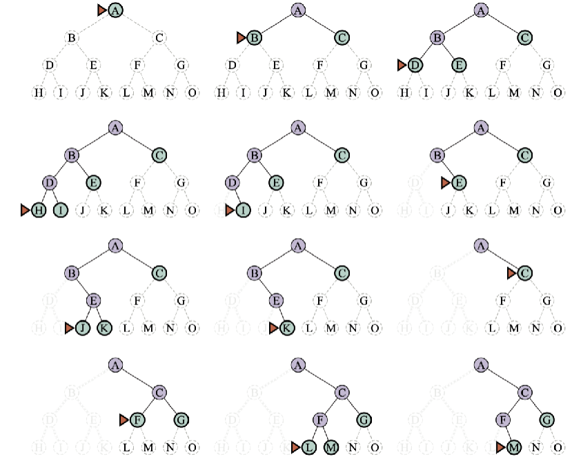
- Uses a LIFO queue (stack)
- Finds the deepest (aka leftmost) solution in search tree

| Criteria | Result |
|-|-|
|Completeness|No|
|Cost optimal|No <small>(doesn't care about costs)</small>|
|Time complexity| $O(b^m)$|
|Space complexity|$O(bm)$|

#### Depth-*Limited* Search
- This is an extension of DFS
- Introduces a depth limit $L$
    - Chosen based on knowledge of problem

| Criteria | Result |
|-|-|
|Completeness|No|
|Cost optimal|No|
|Time complexity| $O(b^L)$|
|Space complexity|$O(bL)$|

#### Iterative Deepening Search
- A further extension that iterates $L=1$, $L=2$, etc.
    - Until solution can be found

| Criteria | Result |
|-|-|
|Completeness|Yes|
|Cost optimal|Only if costs are same|
|Time complexity| $O(b^d)$|
|Space complexity|$O(bd)$|

### Bidirectional Search
- Search forward from initial state and backwards from goal state
- Run bidirectional best-first search

| Criteria | Result |
|-|-|
|Completeness|Yes|
|Cost optimal|Yes|
|Time complexity| $O(b^{d/2})$|
|Space complexity|$O(b^{d/2})$|

### Uniform-cost Search
- Dijkstra's algorithm
- Actions have different costs
- Expands nodes in order of cost from the initial state
    - Uses priority queue
    - Continues/switches the path with the lowest total cost

| Criteria | Result |
|-|-|
|Completeness|Yes|
|Cost optimal|Yes|
|Time complexity|$O(b^{1+\lfloor C^*+\epsilon\rfloor})$|
|Space complexity|$O(b^{1+\lfloor C^*+\epsilon\rfloor})$|
- $C^*$ is the cost of optimal path
- $\epsilon$ is a lower bound on the cost of each action (where $\epsilon > 0$)

#### Example
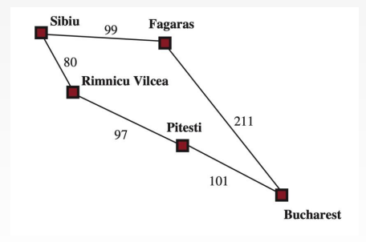
- Steps
    - S->R: 80
    - S->R->P: 177
    - S->F: 99
    - S->F->B: 310
    - S->R->P->B: 278

### Summary
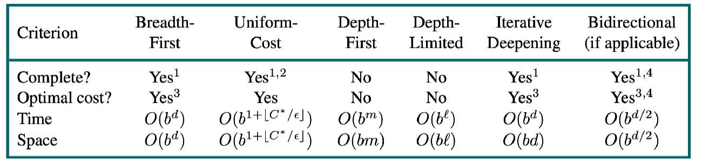
1. Complete if $b$ is finite, and the state space either has a solution or
is finite.
2. Complete if all action costs are $\geq \epsilon > 0$;
3. Cost-optimal if action costs are all identical;
4. If both directions are breadth-first or uniform-cost

<!-- ======================================================================= -->
## Informed Searches
- Uninformed searches can be both complete and optimal
    - However, they can be really slow
- <u>Informed Search</u> may be a better alternative
    - Uses <u>hints</u>, or domain-specific knowledge
    - Can find solutions more efficiently
- Informed searches makes use of the <u>Heuristic function</u>
    - Denoted by $h(n)$
    - <u>Heuristics</u> can speed up search algorithms

### Heuristics
- The heursitic function makes estimates of the cheapest path
    - From state at node $n$ to goal state
- Designed for a particular search problem
- Examples
    - Manhattan distance: $|x_1 - x_2| + |y_1 + y_2|$
    - Euclidean distance: $\sqrt{(x_1-x_2)^2 + (y_1-y_2)^2}$
- One way is to use the <u>straight-line distance</u>
    - Denoted by $H_{SLD}$
    - Measures the distance of a straight line from state to goal
    - Uses these measurements as its heuristics

### Greedy Best-First Search
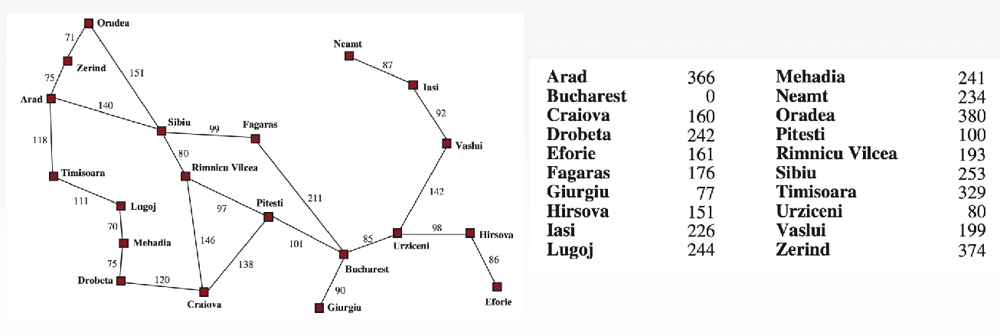

- Note that the table of numbers are the results from $H_{SLD}$
- Strategy is to expand the node with the lowest $h(n)$ value<br>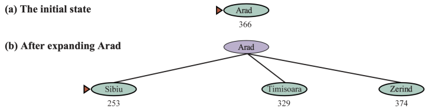
    - We would expand Sibiu next since it has the lowest $h(n)$ value (based on table)
    - Next would be Fagaras<br>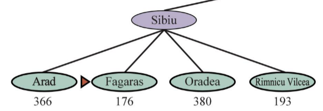
- Operates like UCS with a priority queue
    - Difference is that is uses estimated forward cost
    - UCS uses computed backward cost
- Not optimal
- Could not find the best solution
    - Could not even find any solution if we have a bad $h(n)$
- Worst-case is like a badly-guided DFS where we explore all the wrong areas

### A* Search
- Combines UCS and Greedy searches
- $f(n)=g(n)+h(n)$
    - Uses the lowest estimated cost of the path from $n$ to $G$
    - $g(n)$ is the path cost from the initial state to node $n$
- Uses a priority queue
- A* combines the total backward cost and estimated forward cost
    - Combines actual edge costs with predicted values from $h(n)$
- Yields an **estimated total cost** from start to finish
- Example:<br>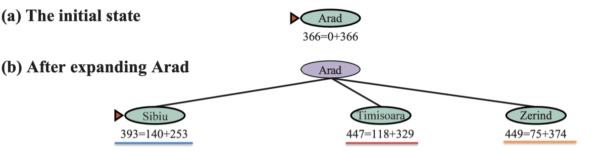
    - We still go to Sibiu since it has the lowest total sum
    - Instead of going to Fagaras next, we go to Rimicu Vilcea<br>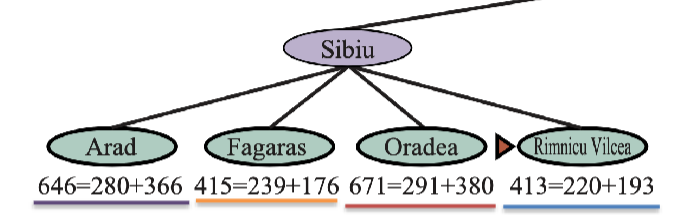
- Is complete
- Cost optimality depends on properties of heuristic function<br>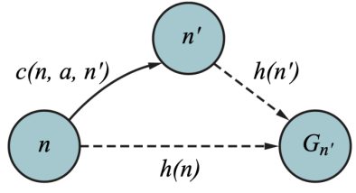
    - <u>Admissibility:</u> means to be optimal, never overestimates the cost ($0 \leq h(n) \leq h^*(n)$)
    - <u>Consistency:</u> $h(n) \leq h(n') + cost(n,a,n')$
- <u>Weighted A*</u> adds weights to the heurstics
    - $f(n)=g(n)+W\cdot h(n)$
    - Faster search, slightly costlier, and not always cost optimal

#### Admissible
- A* is cost-optinmal with an admissible herusitic
    - Can sometimes still be cost-optimal even if it has an inadmissable herusitic
- Coming up with admissable heursitics is most of what's invovled in using A* in practice

#### Consistency
- A consistent heuristic is an admissible herusitic
- Example:<br>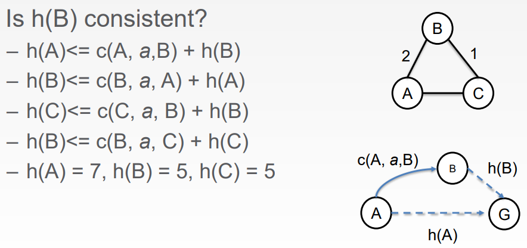
    - $h(A)\leq c(A,a,B)+h(b)\rArr (7)\leq(2)+(5)\rArr7\leq7 \checkmark$
    - Repeat for all other statements and plug in values

### Memory-Bounded Search
- Beam search: limits the size of the frontier
- Iterative-deepending A* search
- Bidirectional A* search
- Recursvie best-first search
- Simplied memory-bounded A*
