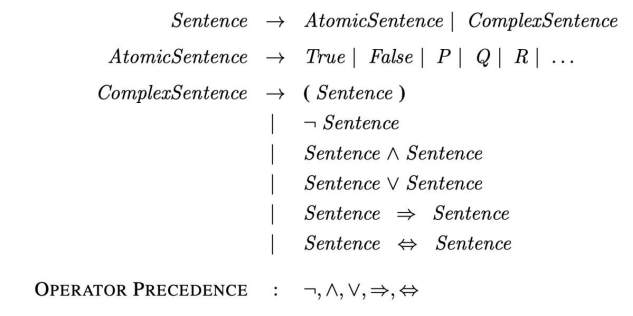
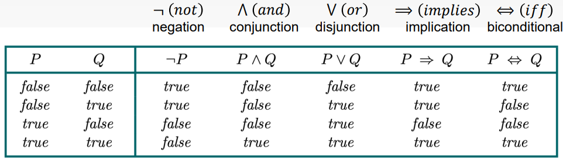
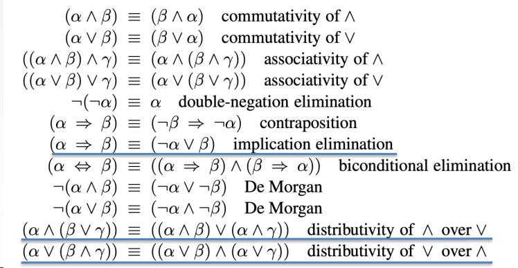
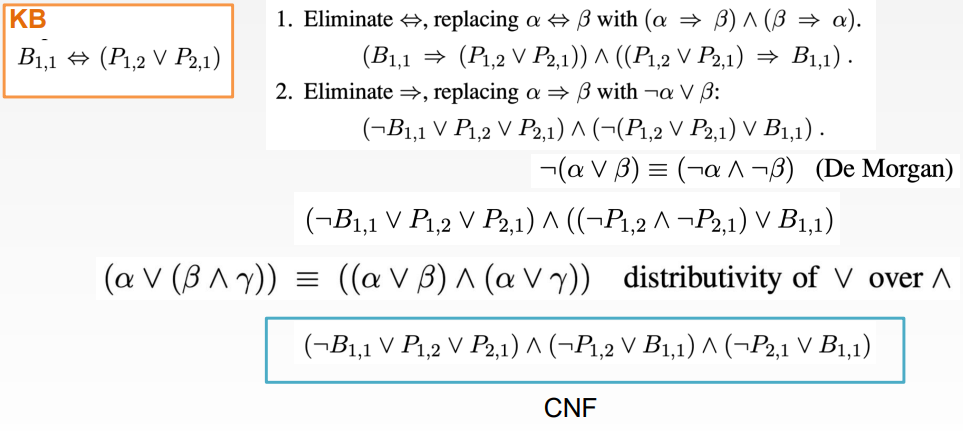
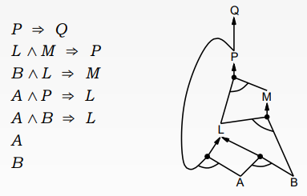
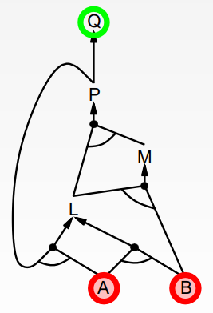

# AI Logic

## Knowledge-based agent
- A <u>knowledge-based agent</u> has a central component called the <u>knowledge base (KB)</u>
    - KB is a set of sentences in a formal language
    - A <u>sentence</u> represents some assertion about the world using knowledge representation language
- Agent makes an action based on what it knows and its goals
- Declarative approach to build an agent
    - **Tell** it what it needs to know (or have it **learn** it)
    - Then **ask** itself what to do (follows from KB)
- An <u>inference algorithm</u> can answer any answerable question
- Minesweeper example
    - Tell: # on block shows # adjacent mines
    - Ask: put a flag on block when you confirmed it has a mine
    - Goal: flag all mines without blowing up
- PEAS is a great way to design knowledge-based agents

## Logic Models and Entailment
- <u>Sentence:</u> represents some assertion about the world using knowlesge representation language
- <u>Axiom:</u> a sentence that is taken to be true, to serve as a premise or starting point for further reasoning and arguments
- Every sentence must be true or false in each possible world (or model)
- New sentence is derived from an old sentence through <u>inference</u>
    - We don't want to tell the agent too much
    - Want to have it learn itself as much as possible
- Knowledge representation language has syntax
    - $X+Y=4$ is a well formed sentence
    - $4xy+$ is not
- Logic has both <u>syntax</u> and <u>semantics</u>
    - Syntax: what sentences are allowed
    - Semantics: what are the possible worlds, and what do each sentence mean in each world
- Examples
    - $x+2\geq y$ is a sentence, $x2+y>$ is not a sentence
    - $x+2\geq y$ is true iff the number $x+2$ is no less than the number $y$
    - $x+2\geq y$ is true in a world where $x=7,y=1$
    - $x+2\geq y$ is false in a world where $x+0,y=6$

### Models
- Usually use the propositional symbols $P,Q,R$
    - Syntax: $P \lor Q (\land R)$
- Semantics define the truth of each sentence with respect to each possible world
    - $X+Y=4$ is true iff in the world that $X=2, Y=2$
- A possible world is called <u>model</u>
- A sentecen $\alpha$ is true in the model $m$ if:
    - $m$ satisfies $\alpha$
    - $m$ is a model of $\alpha$
- $M(\alpha)$: the set of all models of $\alpha$
- Example
    - Sentence $x+y=4$
    - $M(\alpha)$:  $\{\{x=1,y=3\},\{x=0,y=4\},\{x=2,y=2\},...\}$, etc.

### Entailment
- <u>Entailment</u> means that one thing follows from another
    - $\alpha \vDash \beta$ means "sentence $\alpha$ entails sentence $\beta$"
    - $\alpha \vDash \beta$ iff in every model where $\alpha$ is true, $\beta$ is also true
    - $\alpha \vDash \beta$ iff $M(\alpha)\subseteq M(\beta)$
- A relationship between sentences that is based on semantics
- Examples
    - $x+y=4$ entails $4=x+y$
    - "The Giants won" and "The Reds won" entails that "Either Giants or Reds won"
- Entailment can be applied to derive conclusions
- Given $\alpha$ with propositional logic sentences, check if sentence $\beta$ is true
- Naive approach: model-checking
    - Checks all possible models
    - $M(\alpha) \subseteq M(\beta)$
- Better approach: theorem proving
    - Come up with a proof to show/dispprove $\alpha$ to $\beta$
    - Applies inference rules
- New sentences can be derived from KB by an <u>inference algorithm</u> $i$
    - $KB \vdash _i \alpha$
- 2 main criteria:
    - <u>Sound/truth-preserving:</u> only derives entailed sentences (nothing but the truth)
    - <u>Complete:</u> dervies any sentence that is entailed (the whole truth)

## Propositional Logic
- Proposition symbols: $P$, $Q$, $W_{1,2}$, $GoHokies$, etc.
    - Basically just variables in the sentence
- Logcal connectives: $\neg,\lor,\land,\rArr,\iff$
- Complex sentences comes from a combination of symbols and connectives 
- Propositional logic is the simplest logic
    - Illustrates basic ideas
    - Starts off with just the symbols ($P_1$, $S_3$, are sentences)

|Symbol|Usage|Meaning|
|-|-|-
|$\neg$|$\neg S$|negation of $S$ (not)
|$\lor$|$S_1\lor S_2$|disjunction (or)
|$\land$|$S_1\land S_2$|conjunction (and)
|$\rArr$|$S_1\rArr S_2$|implication (if/then)
|$\iff$|$S_1\iff S_2$|biconditional (iff)

- The semantics defines the rules for determining the truth of a sentence wrt a particular model
    - $P\land Q$ is true iff $P$ is true and $Q$ is true in $m_1=\{P=true,Q=true\}$
    - $P\land Q$ is not true iff $P$ is false and $Q$ is true in $m_1=\{P=false,Q=true\}$

## Equivalence, Validity, Satisfiability
- 2 sentences are <u>equivalent</u> ($\equiv$) iff $\alpha\vDash\beta$ and $\beta\vDash\alpha$
-  Example equivalences: 
- A sentence is <u>valid</u> if it is true in all models (ex $P\lor\neg P$)
    - Also called *tautologies*
    - Every valid sentence is logically equivalent to True
- For any sentences $\alpha$ and $\beta$, $\alpha\vDash\beta$ iff the sentence $\alpha\rArr\beta$ is valid
    - Likewise, if $\alpha\rArr\beta$ is true in all models, then $\alpha\vDash\beta$
- A sentence is <u>satisfiable</u> if it is true in *some* model
- SAT problem: problem of determining the satisfiability of sentences in a propositional logic
- Validity and satisfiability
    - $\alpha$ is valid iff $\neg\alpha$ is unsatisfiable
    - $\alpha$ is satisfiable iff $\neg\alpha$ is not valid
    - $\alpha\vDash\beta$ iff the sentence $\alpha\land\neg\beta$ is unsatisfiable

## Theorem Proving
- Applies <u>rules of inference</u> directly to the sentences in KB
    - Creates a proof without consulting models
    - Faster way and more sound than brute forcing all possible worlds
- **Moduus Ponens:** $\frac{\alpha\rArr\beta,\alpha}{\beta}$
    - Whenever we have $\alpha\rArr\beta$ and $\alpha$, we can infer $\beta$
    - Ex: we can infer $Wet$ from $Rain\rArr Wet, Rain$
- **And-Elimination:** $\frac{\alpha\land\beta}{\alpha}$
    - From a conjunction (and), any of the conjuncts can be inferred
    - Ex: we can infer $Wet$ from $\frac{Rain\land Wet}{Rain}$
- **Monotonicity:** if $KB\vDash\alpha$, then $KB\land\beta\vDash\alpha$
- The <u>resolution inference rule</u> takes 2 implication sentences and infers a new implication sentence
    - If KB contains $A$ and $B$, we can infer $A\land B$
- Ex: $A\lor B\lor C$
    - One of $A$, $B$, or $C$ has a book
    - If $B$ doesn't have the book, then either $A$ or $C$ has the book
    - If we know $C$ doesn't have it, then $A$ must have it
- Resolution is complete for propositional logic
- Exponential time in the worst case

### Conjunctive Normal Form (CNF)
- Every logical sentence has a logicall equivalent <u>conjunctive normal form (CNF)</u>
- A sentence is a CNF if it's expressed as a conjunction of <u>clauses</u>
    - **Definite cluase:** a disjunction of literals of which *exactly 1* is positive
    - **Horn clause:** a disjunction of literals of which *at most 1*  is positive
    - **Goal clause:** a disjunction of literals of which *none* is positive
- We can formulate all the information contained in our KB as 1 large CNF
    - Example: 
- The horn clause can be re-written as implications
    - Ex: $(\neg A \lor \neg B \lor C )\equiv(A\land B\rArr C)$

## Forward Chaining
- <u>Forward chaining</u> applies Modus Ponens to generate new facts
    - Given $X_1\land X_2\land...\land X_n\rArr Y$ and $X_1,X_2,...,X_n$
    - We can infer $Y$
- Forward chaining keeps applying this rule
    - Adds new facts until none can be added 
- Requires KB to contain either
    - (conjunction of symbols) $\rArr$ symbol
    - A single symbol (b/c $X\equiv (True \rArr X)$)
- The algorithm:
    - Starts with a set of inference rules
    - Goes through all posisble sentences $f_1,...,f_k$ and adds sentence $g$ to KB if a matching rule exists
    - Repeat until no more additions can be made to KB
- Forward chaining is both sound and complete
- Data-driven reasoning
- Example for $P\rArr Q$: 
    - Starts from the bottom and moves its way up

### Backward Chaining
- <u>Backward chaining</u> is the reverse process of forward chaining
    - Works backward from the query $q$
    - Finds implications in the KB whose conclusion is $q$
    - If all these implications can be proved to be true, then $q$ is true
- Goal-directed reasoning
- Touchs only relevant facts
- Cost is much less
- Example: 
    - We start from the top and work down
