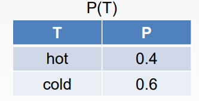

# Probability
- The world is full of uncertainty
- Some definitions:
    - <u>Rational decision:</u> the right thing to do
    - <u>Probability theory:</u> the main tool for dealing with degrees of <u>belief</u>
    - <u>Probabailistic reasoning</u> gives us a framework for managing beliefs and knowlesge
- Real world problems contain uncertainties due to
    - Partial observaility
    - Nondeterminism
    - Adversaries
- Ex: Dental diagnosis using propositional logic
    - $Toothache\rArr Cavity$
    - However, not all toothaches result in cavities
    - $Toothache\rArr Cavity\lor GumProblem\lor Abscess \lor ...$
    - We would need to add every possible outcome
    - To fix this, we need to make it logically exhaustive
- <u>Decision theory:</u> probability theory + utility theory
    - An agent is rational iff it chooses the action that yields the highest expected utility
    - Averaged over all possible outcomes of the action
- Example function:<br>

## Basic Notation
- Sample space $\Omega$ contains all possible worlds
- Element of the space $\omega$ is a particular possible world
- Prob model associates a numerical probabilty $P(\omega)$ with each possible world
- <u>Event:</u> a set of outcomes
    - Ex: probabilty that 2 dice add up to 11
- <u>Evidence:</u> an event that has already been revealed
    - Ex: the first die may already be showing a 5
- The basic axioms of prob theory state:
    - Every possible world has a probabilty between 0 and 1
    - Total prob of the set of possible worlds is 1
    - $0\leq P(\omega)\leq1$ for every $\omega\in\Omega$
- <u>Unconditional/prior prob:</u> degrees of belief in propositions in the absence of any other information

## Random Variables
- <u>Random variables (RVs)</u> are variables in prob theory
- Represents an event whose outcome is unknown
    - Ex: (weather) will it snow today?
- Typically begins with an upper letter
- Each <u>RV</u> has a domain, and each domain has <u>values</u>
    - Values are lowercase
- Examples:
    - Temperature in {hot, cold}
    - Weather in {sun, rain, cloud, snow}
- Sometimes we want to talk about probabilities of every possible value
    - One way to write it is:
        ```
        P(Weather = sun) = 0.6
        P(Weather = rain) = 0.1
        P(Weather = cloud) = 0.29
        P(Weather = snow) = 0.01
        ```
    - Or we can abbreviate:
        ```
        P(Weather) = (0.6, 0.1, 0.29, 0.01)
        ```
- The <u>P statement</u> defines a prob distribution for RV

## Probability Distributions
- A <u>probability distribution</u> is an assignment of weights to outcomes
    - Each value has a prob
    - Ex: $P(T=hot)=P(hot)=0.4$
- A distribution is a table of probabilities of values<br>
    - Each prob value $\geq0$ and the sum of all probabilities $=1$
- A <u>joint distribution</u> is a table of probabilities which captures the likelhood of each possible outcome
    - Over discrete random variables
    - Assigns values to random variables
    - Ex: $P(T=hot, W=rain)=P(hot,rain)$<br>
- A <u>probabilistic model</u> is a joint distribution over a set of RVs
    - Each RV has a domain
    - Assignments are called <u>outcomes</u>
    - The join distr assigns values to each RV, which all adds up to 1
- An <u>event</u> is a set of outcomes
    - $P(E)=\sum_{(x_1...x_n)\in E}P(x_1...x_n)$
- From a joint distr, we can calc the prob of any event
    - $P(cold\land sun)=0.2$
    - $P(cold)=0.2+0.3=0.5$
    - $P(cold\lor Sun)=0.2+0.3+0.4=0.9$
- Probability axioms
    - $P(\neg a)=1-P(a)$
    - $P(a\lor b)=P(a)+P(b)-P(a\land b)$
- <u>Marginalization</u> sums up the probs of all possible outcomes<br>
    - Ex: Marginal prob of cavity is $P(cavity)=0.108+0.012+0.072+0.008=0.200$
- Marginal distr are subtables that eliminate variables

## Conditional Distribution
- <u>Conditional/posterior prob</u>: existing evidence affects new prob values
- Prob of $a$ given $b$" $P(a|b)=\frac{P(a\land b)}{P(b)}$
    - Also wirrte as $P(a\land b)=P(a|b)P(b)$
- Example: $P(sun|cold)=\frac{P(sun\land cold)}{P(cold)}=\frac{0.2}{0.5}=0.4$
- A <u>conditional distr</u> are prob distr over some variables given fixed values of others<br>
- <u>Chain rule:</u>
    - $P(x_2,x_1)=P(x_2|x_1)P(x_1)$
    - $P(x_3,x_2,x_1)=P(x_3|x_2x_1)P(x_2|x_1)P(x_1)$
    - And etc.

## Inference
- <u>Prob inference</u> computes a desired prob from other known probs
    - Usually computes conditional probs
    - Ex: $P(A_{90}|no traffic)=0.9$
    - Represents the agent's beliefs given the evidence
- Probs will change with new evidence
    - $P(a_{90}|no traffic, 4am)=0.95$
    - $P(A_{90}|no traffic, 4am, snowing)=0.2$
- <u>Bayes' Rule:</u> $P(a | b) = \frac{P(b | a) P(a)}{P(b)}$
    - Underlies most modern AI systems
- We can use Baye's Rule with inference
    - We have evidence that's the *effect* of some unknown *cause*
    - We would like to determine that *cause*
- Doctor example:
    ```
    A doctor knows disease $m$ causes a stiff neck 70% of the time. Probability of disease $m$ is 1/50k and stiff neck is 1%
    ```
    - What we know:
        - Disease $m$
        - Stiff neck $s$
        - $P(s|m)$=0.7
        - $P(m)=1/50,000$
        - $P(s)=0.01$
    - Equation: $P(m|s)=\frac{P(s|m)P(m)}{P(s)}=\frac{0.7\times 1/50000}{0.01}=0.0014$
    - $\rArr$ We expect only 0.14% of patients with a stiff neck to have disease $m$ 
- Bayes' Rule can also be combined with normalization
    - $P(Y|X)=P(X|Y)\frac{P(Y)}{P(X)}$
    - $P(Y|X)=\alpha P(X|Y)P(Y)$
    - $\alpha$ is the normalization constant needed to make the entires in $P(Y|X)$ sum to 0

## Independence
- Events are <u>independent</u> if they have no effect on each other
    - $P(x|y)=P(x)$
    - $P(x\land y)=P(x)P(y)$
    - $X \perp \!\!\! \perp Y$

## Summary
- **Probabilities** quantify the uncertainty an individual has about the truthfulness of a statement
- **Decision theory** combines the agent’s beliefs and desires, defining the best action as the one that maximizes expected utility
- Basic probability statements include **prior** or **unconditional** probabilities and **posterior** or **conditional** probabilities over simple and complex propositions
- The axioms of probability constrain the probabilities of logically related propositions
- The **full joint probability distribution** specifies the probability of each complete assignment of values to random variables
- **Absolute independence** allows the joint distribution to be simplified into the product of individual distributions, as the variables are independent
- **Conditional independence** allows the joint distribution to be simplified into smaller, conditional distributions, given a specific variable that makes them independent
- **Bayes’ rule** allows unknown probabilities to be computed from known conditional probabilities
