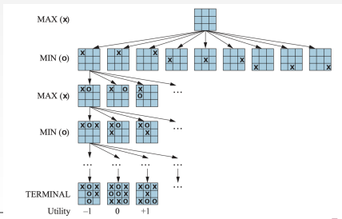

# Game
- In a <u>game</u>, an agent will have opponents
- Some examples
    - Chess: Deep Blue 1997 defeated Kasparov
    - Checkers: solved in 2007
    - Poker: 2018 AI beats top-ranked professional in poker
## Game Theory
### Types of Games
- Deterministic or stochastic?
    - Determinsitic: exxact same output for the same inputs
    - Stochastic: same inputs may have different outputs (chaos)
- Single player? 2 players? More?
- Zero Sum?
- Perfect information (aka fully observable?)
- Example:
    - Chess is a deterministic, two-player, turn-taking, perfect information, and zero-sum game
    - StarCraft II is a deterministic, multi-player, real-time, partially observable, and zero-sum game

### Deterministic Games
- Many possible formalizations:
    - States: $S$ (starts at $s_0$)
    - Players: $P=\{1...N\}$ (usuually takes turns)
    - Actions: $A$ (may depend on player/state)
    - Transition Function: $SxA\rarr S'$
        - Applies actions to states
    - Terminal Test: $T(S)$
        - Checks if end of game
    - Terminal Utilities: $SxP\rarr R$
- The solution for a player is a policy $S\rarr A$

### Zero-Sum Games
- Agents have oppositve utilities
- Agent MAX vs Agent MIN
    - **Max**: maximizes the value/points/scores
    - **Min**: minimizes the value/points/scores
- Pure competition
- Adversial
- Examples: Chess, Clash Royale, etc.

### 2-Player Zero-Sum Game
- States: $S$ (start at initial state $S_0$)
- $To-Move(s)$: Move in state $s$
- $Action(s)$: Set of legal moves in state $s$
- $Result(s, a)$: The transition model. The state resulting from taking action $a$ in state $s$
- $Is-Terminal(s)$: A terminal test that checks if it's game over?
    - Terminal states: States where the game has ended
- $Utility(s, p)$: A utility function which defines the final number value to player $p$ when the game ends in terminal state $s$

### General Games
- Agents have independent utilities (values on outcomes)
    - Everyone worries about themselves
- Cooperation, indifference, comeptition, and more are all possible strats

## Adversarial Search
- Deterministic, zero-sum games
    - Tic-tac-toe, chess, Go, etc.
    - 1 player maxes the result
    - The other player mins the result
- Example: 2-ply game tree
    - A state-space search tree
    - Players $(MAX,MIN)$ alternate turns ($ply$)
    - Compute the <u>minmax value</u> of each node in the tree and select the best (achievable) utility against the adversary
- Example game tree: 
    - The terminal state is the end game
    - Final utility can be positive (max), negative (min), or 0 (tie)

## Pruning
- Some game trees can be massive
    - Ex: Chess has roughly $10^123$ branch outcomes
    - Exploring every singly one would be inefficient
- General idea behind <u>alpha-beta pruning</u> is to eliminate branches that you know will never be evaluated
    - Suppose a player can move to $n$
    - However, $m$ is a better choice for player A
    - $m'$ is a better choice for player B
    - $n$ will never be chosen by either player so no need to explore it
- AB pruning can be applied to trees of any depth
    - Can prune entire subtress or just leaves
- We store 2 variables: $\alpha$ and $\beta$
    - For MAX and MIN's best choices respectively
    - [see demo on slide 20]
- States can be safely pruned bc it makes no difference to outcome
- Effectiveness is highly dependent on the child ordering
    - With perfect ordering, time complexity drops from $O(b^m)$ to $O(b^{m/2})$
    - Random moves is more consistent, but only $O(b^{3m/4})$

## Resource Limits
- Resources are limited, so sometimes game trees can be too big
- Solution is to use a <u>heuristic eval function</u>
    - Replaces $Utility$ with $Eval$
    - Replace $TerminalTest$ with $CutoffTest$
    - Searches only a limited depth in the tree (depth-limited search)
- Cutoff test
    - Returns true for terminal states
    - Decides to cut off the search

### Shannon's Strageies
- Type A
    - consider only a certain depth in the search tree
    - Use $Eval$ to estimate the utility
    - Explores a **wide**, but **shallow** portion of the tree
- Type B
    - Ignores moves that look bad
    - Follows promising lines "as far as possible"
    - Explores a **deep** but **narrow** portion of the tree
- Suited for different scenarios
    - Chess is better for Type A
    - Go is better for Type B

### Eval Functions
- Less computation time
- Should be strongly correlated with the actual chances of winning
    - $Eval(s)>Eval(s')$
- Return an estimated value about the outcome
    - Expected utility of state $s$ to player $p$
- A linear combo of features (weighted linear function)
    - $Eval(s)=w_1f_1(s)+w_2f_2(s)+...+w_nf_n(s)$
    - $f_i(s)$ is a feature extracted from the input state $s$
    - $w_i$ is a weight assigned to a feature
- Example: checkers
    - Features: # agent pawns, # agent kings, # opponent pawns, # opponent kings
    - Select positive weights for agent and negative weights for opponents
    - Kings have more weights than pawns
    - Ex: $Eval(s)=2\cdot agent_kings(s)+agent_pawns(s)-2\cdot opponent_kings(s)-opponent_pawns(s)$
- Features and weights come from fine-tuning and experimenting
    - Either human experience or ML

### Heuristic Eval Fubctions
- Cutting off search
    - If $game.Is-Cutoff(state, depth)$, then return $game.Eval(state,player), null$
    - Set a fixed depth limit
    - Iterative deepnding
    - Use a transposition table
- Forward pruning
    - Prunes possible poor moves
    - Saves computation time at the risk of pruning good moves
- Beam search
    - Consider only a "beam" of the $n$ best moves
    - Also could possibly prune good moves
- PROBCUT (probabilistic cut)
    - Use statistics gained from prior experience
    - Prune nodes that are probably no need to be considered

## Search vs Lookup
- Create a table and lookup
- Opening sequences most often lead to a win
- Policy: map every possible state to the best move in that state
