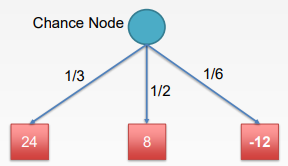
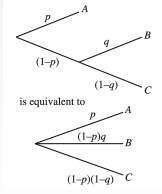
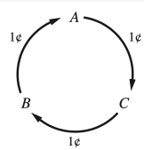

# Utility
- A <u>stochaistic game</u> combines luck and skill
    - Uncertain outcomes
    - Ex: games that include dice rolls

## Expectiminimax
- Explicit randomness
- Expands on the minimax algorithm
- <u>Expectminimax value</u> for a game with chance nodes
- <u>Chance node</u> is an expected value
    - Sum of value over all outcomes
    - Weighted by the prob of each chance action
- Computes the average score under optimal play
- Example: 
  - Expected value $V=(\frac{1}{3})(24)+(\frac{1}{2})(8)+(\frac{1}{6})(-12)=10$

## Utilities
- <u>Utilities</u>: are functions from outcomes (state of the world) to real numbers that describe an agent's <u>preferences</u>
    - Summarizes the agent's goals
- Theorem: any rational preferences can be summarized as a utility function
    - Ex: $Game(+1/-1)$
- Agents make actions based on desirability of their immediate outcomes (state)
    - Buying a lottery, picking a movie to watch, taking a class, etc.
- Agent chooses the action based on its preferences
- Agent's preferences are captured by a utility function $U(s)$
- $U(s)$ assignes a value to express the desirability of a state

### Max Expected Utility (MEU)
- $EU(a)$: Expected utility of an action $a$ given the evidence
- $P(Result(a)=s')$: the probability of reaching state $s'$ by doing action $a$ in the current state
- $EU(a)=\sum_s'P(Result(a)=s')U(s')$
- Principle: A rational agent should choose the action that maxes the agent's expected utility
    - $action=argmax EU(a)$

### Preferences
|Symbol|Meaning|
|-|-|
|$A\succ B$|Agent prefers $A$ over $B$|
|$A \sim B$|Agent is indifferent between the 2
$A\succeq B$| Agent weakly prefers (either prefers or is indifferent)

- In a lottery, there are 2 possible outcomes
    - An agemt must have preferences among prizes $A$ or $B$
    - $L=[p,A;(1-p),B]$

### Constraints
|Constraint|Equation|Meaning
|-|-|-|
|Orderability|$(A\succ B)\lor(B\succ A)\lor(A\sim B)$|A rational agent must either prefer A or B, or be indifferent
|Transitivity|$(A\succ B)\land(B\succ A)\rArr(A\succ C)$| If agent prefers A to B and B to C, then it prefers A to C
|Substitutability|$A\sim B \rArr [p,A;(1-p),C]\sim[p,B;(1-p),C]$|If agent is indifferent between A and B, then A and B can be substituted with each other
|Monotonicity|$A\succ B\rArr(p\geq q \iff[p,A;(1-p;),B]\succeq[q,A;(1-q),B])$|If agent prefers A over B, then it prefers lottery where A has the highest probability
|Decomposability|$[p,A;1-p,[q,B;1-q,C]\sim[p,A;(1-p)q,B;(1-p)(1-q),C]$|

## Irrational Behavior
- Nontransititive preference: $A\succ B\succ C\succ A$
    - Agent currently has $A$
    - Gives out 1 point to $C$ (since it prefers C over A)
    - Gives 1 point to $B$
    - Gives 1 point to $A$
    - There is no end 
- Rational preferences lead to utility
    - $U(A)>U*(B)\iff A\succ B$
    - $U(A)=U(B)\iff A\sim B$
- Sometimes utilites are normalized
    - $u_{min}=0,u_{max}=1$

### Human Rationality
- Humans and agents often differ
    - Agents only have expected value, humans use intuition
    - hunabs like guarantees
- 90% survival rate sounds better than 10% death rate
- Humans are more irrational than any other animals 💀
