# Constraint Satisfaction Problems (CSP)
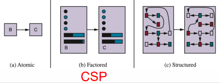
- A special subset of search problems
    - More complicateddue to constraints
    - Closer to real world problems
- State is represented by <u>factored reprersentation</u>
    - A vector of attribute values
    - Boolean, real-valued
- Goal test: When each variable has a value that satisfies all the constraints on the variable
- A type of <u>identification problem</u>

## Planning vs Identification
- Planning: sequences of actions
    - Path to the goal
    - Each path has a cost
    - Depths of the search tree
    - Domain-specific herusistics that guide agent
- Identification: assignments to variables
    - The most important is to archive the *goal*, not the *path*
    - CSPs are specialized identification problems

## Components
- $X$ is a set of <u>variables</u>
- $D$ is a set of <u>domains</u>
    - One for each variable
    - Consists of a set of allowable values
- $C$ is a set of <u>constraints</u>
    - Specifies allowable combinations of values

## Assignments
- <u>Variables</u>, <u>domains</u>, and <u>constraints</u> are all sets
    - Denoted by capital letters (ex. $X$, $D$, and $C$)
- An <u>assignment</u> that fulfills all constraints is called a <u>consistent</u> or <u>legal</u> assignment
    - A <u>partial assignment</u> has some variables unassigned
    - A <u>complete assignment</u> is that every variable is assigned a value
- A <u>solution</u> to a CSP is a consistent, complete assignment
    - A <u>partial solution</u> is a partial assignment that is consistent
- CSP is an <u>NP-complete</u> problem
    - There doesn't exist any known algorithm for finding solutions in polynomial time

### CSP Example: Map Coloring
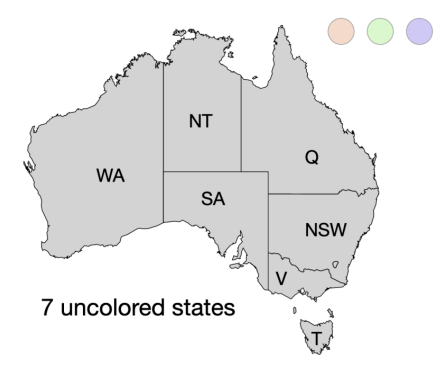
- Variables $X:\{WA, NT, SA, Q, NSW, V, T\}$
- Domain $D=\{red,green,blue\}$
- Constraint $C$ = adj regions must have different colors
- Goal test: does the current assignment satisfy all constaints?
- Solutions are assignment satisfying all constraints
    - Example: 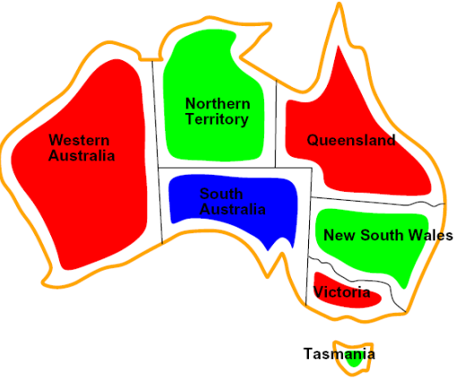

## Real World CSPs
- Meeting schedule problem
- Transpotation schedule problem
- Sudoku
    - Variables: each (open) square
    - Domains: $\{1,2,3,...,9\}$
    - Constraints
        - 9-way all diff for each column
        - 9-way all diff for each row
        - 9-way all diff for each region
- Cryptarithmetic 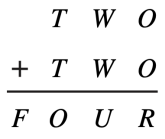
    - Variables: $F,T,U,Q,R,O,C_1,C_2,C_3$
    - Domain: $\{0,1,2,3,4,5,6,7,8,9\}$
    - Constraints: $alldiff(F,T,U,W,R,O)$

## Constraint Graph
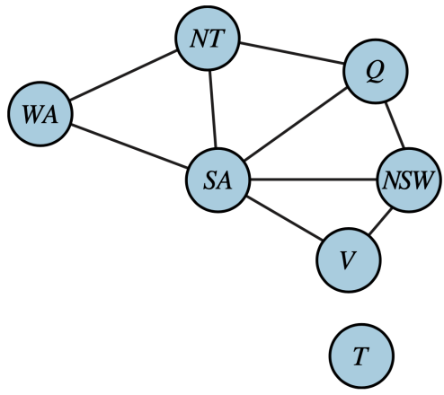
- Node is a variable
- Edge connects 2 nodes that participate in a constraint
- <u>Unary constraint</u> restricts the value of a single variable
    - $<(SA),SA \neq green$
- <u>Binary constraint</u> involves 2 variables
    - $SA \neq NT$
- Binary CSP: each constraint relates (at most) 2 variables
- Note that the island $T$ is an independent subproblem

## Domain/Constraint Types
### Domains
- Simplest: discrete and finite domains
    - Map coloring, scheduling with time limits, 8-queens problem, etc.
- Discrete with infinite domains
    - Integers, strings, etc.
    - Ex: scheduling with no deadline (infinite start time)
    - Linear constraints are solvable
    - Nonlinear constraints are undecideable
- Continuous domains
    - Ex: start/end times for Hubble Telescope observations
    - Linear constraints are solvable in polynomial time by Linear programming

### Constraints
- Simplest: unary constraint
    - Restricts the value of a single variable
    - Ex: $SA\neq green$
- Binary constraints
    - Relates 2 variables
    - Ex: $SA\neq NT$
- Higher-order constraints
    - Involves 3+ variables
    - Ex: $<(X,Y,X), X<Y<Z>>>$
- Global contraints
    - Arbitrary number of variables
    - Ex: <u>alldiff</u> (all variables in constraint must have diff values, like Sudoku)

### Absolute vs Preference Constraints
- Indiciates which solutions are preferred
- Ex: Class-scheduling problem
    - Absolute: prof can only teach one class at a time
    - Preference:
        - Prof R prefers teaching in the morning
        - Prof C prefer teaching in the afternoon
    - Making Prof R teach at 2p is still an allowable solution, just not an optimal one
    - Often represented as <u>cost</u> for an assignment
    - This is known as a <u>constrained optimization problem (COP)</u>

## Standard Search Formulation
- States defined by the values assigned so far (partial assignemnts)
    - Initial state: the empty assignment $\{\}$
    - Successor function: assign a value to an unassigned variable
    - Goal test: the current assignment is completed and satisfies all constraints

### Constraint Propagation
- Atomic state-space search algorithm: expands a node to visit the successors
- CSP algorithm
    - Generates successors by choosing a new variable assignment
    - Constraint propagation is a specific type of inference
- <u>Constration propogation</u>:
    - Uses the constraints to reduce the number of legal values for a variable
    - Have fewer choises to consider for the next choice of a variable assignment
    - May be done as a preprocessing step before the search starts
    - Local consistency

## Consistency
### Nodes
- If all the values in the variable's domain staisfy the variable's unary constraints
    - $\langle(SA),SA\neq green\rangle \rarr SA\{red,blue\}$
- Each single node's domain has a value which meets that node's unary constraints
- A graph is node-consistent if every variable in the graph is node-consistent

### Arc
- If every value in the variable's domain satisfies the variable's binary constraints
- For each pair of nodes, any consisten assignment to one can be extended to the other
    - Variable $X_i$ is arc-consistent with another variable $X_j$
    - For every value in $D_i$, you can find a value in $D_j$ that can satisfy the binary constraint on the arc $(X_i,X_j)$
- A graph is arc-consistent if every variable is arc-consistent with every other variable

### Path
- Tightens the binary constraints by looking at triples of variables
- A set $\{X_i,X_j\}$ is path-consistent wrt a third variable $X_m$ if every assignment $\{x_i=a,x_j=b\}$ consistent with the constraints on $\{X_i,X_j\}$, there is an assignment to $X_m$ that satisfies the constraints on $\{X_i,X_m\}$ and $\{X_m,X_j\}$\

### K-consistency
- Increasing degrees of consistency
    - 1-consistentcy: node
    - 2-consistency: arc consistency
    - 3-consistency: path consistency
- K-conssitency: for each $k$ node, any consistent assignment ot $k-1$ node can be extended to the $k$th node
- K-consistent CSP: any set of $k-1$ variables and any consistent assignment
- Strong k-consistent CSP: it is k-consistent, k-1 consistent, k-2 conssitent, ..., 1-consistent

### Global Constraint
- Occurs frequently in real problems
- Can be handled by special-purpose algorithms that are more efficient than the general-purpose algorithms
    - Ex: alldiff constraint

## Filtering 
- Keeps track of domains for unassigned variables and cross off bad options

### Forward Checking
- Crosses off values that violate the constraint when added the existing assignment
    - Think about Sudoku
    - Write down possible values and use process of elimination
- Propogates info from assigned to unassigned variables
    - Doesn't provide early detection for all failures
    - Arc consistency detects failure earlier than forward checking
- AC-3 Algorithm
    - First store all arcs in the CSP in a queue $Q$
        - Each binary constraint becomes 2 arcs
        - One in each direction
        - Ex: $Q=[SA\rarr V, V\rarr SA,...]$
    - Remove arc $(X_i,x_j)$ from the $Q$ and make $X_i$ arc-consistent with $X_j$
    - Continue to remove values from the domains of variables until the queue is empty
    - Output: arc-constitent CSP that has smaller domains (or no solution)
    - Time complexity: $O(cd^3)$ where $c$ is # arcs and $d$ is size of largest domain
- Limitations of arc consistency
    - After enforcing arc consistency:
        - Can have one solution left
        - Can have multiple solutions left
        - Can have no solutions left (and not know it)
    - Arc consistency still runs inside a backtracking search

## Backtracking Search
- Basic uninformed algorithm for solving CSPs
- One variable at a time
    - Variable assignest as commutative (WA=red and NT=blue is the same as NT=blue and WA=red)
    - The order of any given set of actions does not matter
    - Only need to consider assignments to a single variable at each step
- Check constraints as you go
    - SElect values that don't conflict with any previously assigned values (assignments)
    - If no such value exists, **backtrack** and return to the previous variable and change its value
    - Might need computation to check the constraints
- DFS with the above 2 improvements is called backtracking search

### Algorithm
- Backtracking = DFS + variable ordering + fail on violation
- General heuristic
    - Select unassigned variable
    - Order domain values
- Inference imposes forward checking, arc-, path-, or k-consistency
- Example: 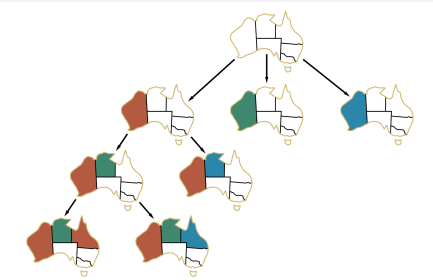
    - Forward checking starts with all colors and uses process of elimination
    - Backward checking adds colors and then backtracks when it's possible to continue

### Inference
- <u>Inference:</u> infer new domain reductions on the neighboring variables
    - Every time when making a choice of a value for a variable
- AC-3 can reduce the domains of variables before the search
- Forward checking:
    - One of the simplest forms of inference
    - Assign variable $X$
    - Go through each unassigned variable $Y$ that is connected to $X$
    - Delete any value in $Y$'s domain that is inconsitent with the value chose for $X$

## Improving Backtracking
- General purpose ideas can give huge gains in speed
- Better ordering
    - Which variable should be assigned next?
    - Which value should be tried first?
- Filtering: Can we detect failure early?
- Structure: Can we exploit the problem structure?
- **Min Remaining Valus (MRV):** Choose the variable with the fewest legal left values in its domain 
- **Degree heauristic:** select the variable that is involved in the largest \# of constraints 
- **Least Constraining Value (LCV):** choose the value that rules out the fewest choices for neighboring variables 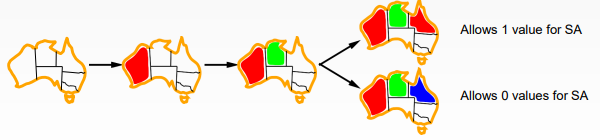
- **Forward checking + MRV**
- **Maintaining Arc Consistency (MAC)**
    - Variable $X_i$ is assigned a value
    - Inference procedure calls AC-3
    - Only the arcs $(X_i,X_j)$ for all $X_j$ that are unassigned variables that are neighbors of $X_i$ are stored in the queue
    - More strict than forward checking
- Local search
    - Finds a good state without worrying about the path to get there
    - Iterative improvement
        - Start with a random assignment to values
        - Iteratively select a random conflicted variable and reassign its value to one that violates fewest constraints
        - Continue until no more constraint violations exist
    - This is also known as the **min-conflict heuristic**
    - Generally much faster and more memory efficient (but incomplete and suboptimal)
    - Local search algorithms can be very effective in solving many CSPs
    - Example: 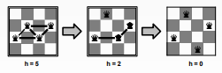

### Hill climbing search
- Most basic local search technique
- At each step, the current node is replaced by the best neighbor
- Greedy local search
- Diagram: 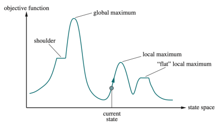
    - Global max: the highest peak
    - Local max: heigher than its neighboring state, but lower than the global max
    - Plateaus: flat area of the state-space landscape
        - Flat local max: no uphill exit exists
        - Shoulder: a plateau with an uphill edge
    - Current state: the region of the state space diagram where we are currently present during the search
- <u>Simulated annealing:</u> escape local max by allowing downhill move

## Program Structure
- Extreme case is where there are independent subproblems
    - Ex: Tasmania and Australia are separate land entities
- Independent subproblems are identifiable as connected components of the constraint graph
- General CSPs have $O(d^n)$ with $n$ variables and $d$ domains
- Suppose a graph of $n$ variables can be broken into subproblems of only $c$ variables
    - Worst case is $O((n/c)d^c)$, linear in $n$
    - Ex: $n=80$, $d=2$, $c=20$ $\rarr$ $2^{80}$ vs $(4)2^{20}$

### Tree-Structured CSP
- One that has no loops in its constraint graph
- We can reduce runtime from $O(d^n)$ to $O(nd^2)$
- We do this via topological sort
- Algorithm
    - Choose a root variable and order variables so that parents preced children 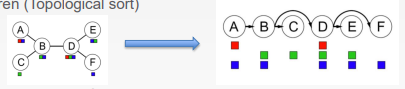
    - Backward pass of arc consistency: for $j=n$ down to 2, apply $MAC(Parent(X_j),X_j)$ 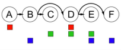
    - Assign forward: for $i=1$ to $n$, assign $X_i$ consistently with $Parent(X_j)$
- Improving structure
    - Idea: reduce general constraint graphs to trees
    - Remove nodes: cutset conditioning
    - Collapse nodes together: tree decomposition

#### Cutset Conditioning
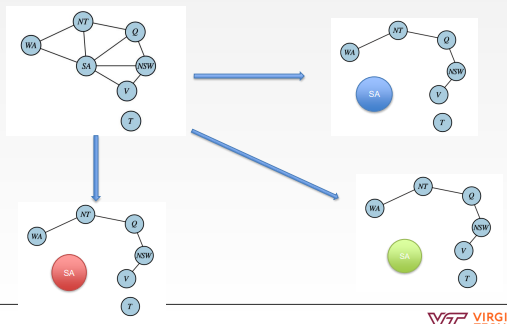
- Choose a subset $C$ of the CSP's variables such that the constraint graph becomes a tree after removing $S$
    - This is usually the smallest subset
- For each possible assignment to the $S$ that satisfies all constraints on $S$
    - Remove any values tht are inconsistent with the assignment for $S$ from the domains of the remaining variables
    - If there is a solution, return it together with the assignment for $S$
- Cutset size $c$ is runtime $O(d^c(n-c)d^2)$

#### Tree Decomposition
- Every variable in the original problem appears in at least one of the tree nodes
- If 2 variables are connected by a constraint, they must appear together in at least one of the subproblems
- If a variable appears in 2 nodes, then it must appear in every node along the path between those 2 nodes
- Runtime $O(nd^2)$ with the tree CSP solver

## Summary
-  CSPs are a special kind of search problem
    - States are *partial* assignments
    - Goal test defined by constraints
- $X$ is a set of variables
- $D$ is a set of domains
    - One for each variable and consist of a set of allowable values
- $C$ is a set of constraints that specify allowable combinations of values
- CSPs are represented as a constraint graph
    - Node: variable
    - Edge: connects 2 nodes that participate in a constraint
- Types of constraints
    - Unary: restricts value of a single variable
    - Binary: restricts for 2
    - Higher-order: 3+ variables
- Binary CSP: each constraint relates at most 2 variables
- Backtracking search: a basic uninformed algorithm for solving CSPs
- Inference
    - Forward checking
    - Arc consistency
- Value ordering
    - Min Remaining Values (MRV)
    - Degree
    - Least Constraining Value (LCV)
- Local search aka min-conflicts heuristic
- Structure
    - Tree structured CSP
    - Cutset conditioning
    - Tree decomposition
