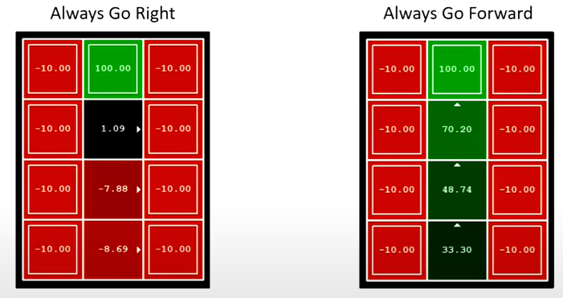

# Markov Decision Process
- A <u>Markov decision process</u> is a sequential decision problem for a fully observable, stochastic environment
    - Impossible to predict outcomes for sure
    - Ex: stepping on a platform may sink
    - Agent's utility depends on a sequence of decisions
- Example: Grid World 
    - Ex: if we want to go up, we will go: 80% up, 10% left, 10% right
    - If hit the wall, agent stops
    - 2 terminal states have rewards +1 and -1
    - All other transitions have a <u>living reward</u> of -0.04
- Agent's goal is to maximize the total reward
- A transition is <u>Markovian</u> if probability doesn't depend on past move
    - Going from state $s$ to $s'$ *only* depends on $s$
    - "Memory-less" property
- If we know the present state, the past doesn't give us any more info
    - $T(s,a,s')=P(s'|s,a)$
- Solving MDPs usually involve dynamic programming

## Problem Definition
- A MDP involves:
    - A set of states $S$
    - A set of actions $a$
    - A starting state
    - Possibly 1+ terminal states
    - A transition model $T(s,a,s')$ from state $s$ to $s'$ via action $a$
        - This replaces successors in search problems
    - A reward function $R(s,a,s')$ that rewards $a$ from $s$ to $s'$
    - Possibly a discount factor $0\leq\gamma\leq1$
- One way to solve MDPs is with expectiminimax

### Policies
- A solution to an MDP is called a <u>policy</u>
    - Policy $\pi$ gives an action to the agent for each state
- An explicit policy results in a reflex agent
    - Everything is precalculated offline
    - For each state $s$, the agent will apply policy to get an action $a=\pi(s)$
    - Doesn't consider future consequences
    - Explicit policy only works when MDP is small
- An optimal policy $\pi^*$ maximizes expected utility
- Example optimal policy: 
    - Calculates which path gives you highest reward
    - Different reward values (both terminal and living) will affect policy

## Utility
- Generally speaking, an agent would want the reward sequence that has the highest total reward
    - Ex: prefers $[2,3,4]$ over $[1,1,2]$
- Agents also want rewards sooner if they're equal
    - Ex: prefers $[1,0,0]$ instead of $[0,0,1]$
    - Agent can also be indifferent
    - One way to make a decision is to use *discounting*

### Discounts
- A <u>discount</u> means that a reward's value will decay exponentially
    - Agent must prefer sooner rewards rather than be indifferent
- We use $\gamma$ for discount factor (between 0 and 1)
    - Close to 0: rewards in distance future are insignificant
    - Close to 1: agent is more willing to wait for better long term rewards
    - Is 1: discount rewards are purely additive
- Value of discount rewards decay exponentially
    - $\gamma^0\rarr\gamma^1\rarr\gamma^2\rarr...$
    - Ex: $\gamma=0.5\rArr U([1,2,3])=0.5^0*1+0.5*2+0.5^2*3<1+2+3$
- Similar to real life banking example
    - We put money in banks to gain interest
    - We also invest in stocks to potentially get more money
- Discounting also helps algorithms to converge on a single value

### Time
- An agent's preferences are <u>stationary</u> if they are independent of time
    - If we prefer $a\succ b$, then we also prefer $a\succ b$ after $t$ time
- Assuming we have stationary preferences, there are 2 ways to define utilities:
    - <u>Additive:</u> $U([r_1,r_2,...])=r_1+r_2+...$
    - <u>Discounted:</u> $U([r_1,r_2,...])=r_1+\gamma r_2+ + \gamma^2r_2+...$
- A <u>finite horizon</u> has:
    - Fixed time limit to gain rewards (anything after doesn't matter)
    - Optimal action for a state may depend on remaining time
    - A <u>nonstationary</u> policy depends on time
- An <u>infinite horizon</u> has:
    - No fixed time limit
    - No reason to behave differently in the same state at different times
    - A stationary policy chooses optimal action based *only on the current state*

### Example

- If $\gamma=1$, optimal policy is to go for 10
    - No discount, so 10 is always better than 1
- If $\gamma=0.1$, we would go to the right on position $d$
    - By the time we get to 10, it'll be 0.001, but the 1 will only be 0.1
- For which $\gamma$ are W and E equally good actions in state $d$?
    - $1\gamma$ = $\gamma^2 10$
    - $\rArr \gamma = \sqrt{\frac{1}{10}}$

### Infinite Utilities
- Discounting and time are solutions to prevent infinite game
    - Discounts helps algorithms to eventually converge on a single point, which ends the game
    - Time forces an end on the game even if there isn't one
- Another way is absorbing state
    - The idea is that a terminal state will eventually be reached
    - The probability of player that keeps "lucking out" tails off of to 0

## Solving MDPs
### Optimal Quantities
- There are 3 optimal values:
    - $U^*(s)$ is expected utility starting in $s$ and acting optimally 
    - $Q^*(s,a)$ is expected value having taken action $a$
        - This is a <u>q-state</u>, which is a possible outcome of taking action $a$
        - Sorta like a chance node
        - Ex: going up in grid world has q-state's up, down, left, and right 
    - $\pi^*(s)$ is optimal action from state $s$
- To get the values, we just compute expectimax values of each state
- $V^*(s)=max_aQ^*(s,a)$
    - The optimal action of a state is the action that produces the highest utility
    - Pretty obvious
- $Q^*(s,a)=\sum_{s'}T(s,a,s')[R(s,a,s^*)+\gamma V^*(s')]$
    - We start off with getting a reward from action $a$, which depends what $s'$ we get
    - After we get into $s'$, we assume we act optimally
    - Note that the future optimal value is discounted
    - We average over all possible $s'$ values
- We combine the 2: $V^*(s)=max_a \sum_{s'}T(s,a,s')[R(s,a,s')+\gamma V^*(s')]$
    - Note that these equations are not meant to compute actual values
    - They only show the relation between states and q-states and futures
    - These are known as the Bellman equations

## Time-Limited Values
- Straight up using expectimax on a search tree is super bad
    - Search trees grow exponentially and are possibly infinite
    - We end up having the same subproblem over and over again
- 2 main ideas to reduce problem size
    - Cache/save values of subproblems so we can reuse them
    - Since $\gamma^x$ will eventually reduce the future rewards to nothing, we can create a cut off (ex $x=100$)
- We define $V_k(s)$ to be the optimal value after $k$ steps
    - Tree is no longer infinite

### Grid world example
- $v_0$ = 0 time steps 
    - This is 0 since we can't do anything in 0 time steps
- $v_1$ = 1 time step 
    - If we're in a terminal state, we could exit within 1 time step
- $v_2$ = 2 time steps 
    - The 0.72 represents both success and failing to make it to the 1.00 in time
    - Technically, if we're on the square to the left of the pit (-1.00), we can exit the game in 2 time steps
    - However, that's not optimal play so we stick to 0
- The more iterations we go through, the more the numbers will converge
    - After a certain point, the policy will be finalized
    - The values themselves may change slightly, but it's insignificant

## Value Iteration

- We start at the bottom, which represents 0 time steps (which all have value 0)
    - As we go up, we calculate for $k+1$ time steps
    - Each vector/level is depth 1
- This is known as <u>value iteration</u>
    - Start at $V_0(s)$ (a vector of 0s)
    - Suppose we have a vector $V_k(s)$, we can compute $V_{k+1}(s)$
    - We adapt the Bellman equation to be: $V_{k+1}(s)=max_a\sum_{s'}T(s,a,s')[R(s,a,s')+\gamma V_k(s')]$
- This has complexity $O(S^2A)$ for each iteration
    - We have to visit each $S$
    - For each $S$, we consider each action $A$
    - And for each action, we consider every $S'$

### Example

- At $V_0$, everything is 0
- At $V_1$
    - Cool wants to go fast to max reward of 2
    - Warm also wants to go fast since it's only 1 time step left
- At $V_2(cool)$
    - Slow
        - Starts off with +1
        - Keeps us cool, so we use the value of $V_1(cool)$, which is go fast (+2)
        - Total is 1+2=3
    - Fast
        - Starts off with +2
        - In cool, we go to $V_1(slow)$ and get +2
        - In warm, we go to $V_1(warm)$ which is +1
        - 50/50 outcome, so average is 3.5
    - Final value is 3.5 since it's better than 3
- At $V_2(warm)$
    - Slow
        - Starts off with +1
        - If we stay warm, we go to $V_1(warm)$ which is 1
        - If we go to cool, then $V_1(cool)$ is 2
        - Total is 2.5
    - Fast
        - Starts off with +1
        - Game ends so 1 is final value
    - Final value is 2.5
- Overheated will always be 0 since it's game over

### Convergence
- How do we know the $V_k$ vectors are going to converge
- Case 1: the tree has max depth of $M$
    - Then $V_M$ holds the actual untruncated values
    - Once I get to the max depth, I know I'm done
    - Uncommon
- Case 2: Discount $\gamma<1$
    - Suppose we have a tree of depth $k$ and a tree of depth $k+1$
    - We can expand the $k$ tree by adding a bottom layer of 0's
    - Essentially, the difference between the 2 trees is the bottom layer
    - The $k+1$ tree's bottom layer has some reward value between $R_{min}$ and $R_{max}$
    - However, it's being heavily discounted since it's so far down
    - As $k$ increases, the difference between the bottom layers decreases
    - Proves that we converge

## Policy Methods
### Evaluation
- All we want to know is how good a policy is
    - Doesn't have to be optimal
- Evaluation is easy for a fixed policy
    - We don't have to worry about $max$ing over chance nodes
    - We simply just follow the path that the policy has planned out
    - Instead of calculating optimal value, we just find $\pi(s)$
    - Only 1 action per state
- We also want to know the utility of a state $s$ under policy $\pi$
    - $V^\pi(s)=\sum_{s'}T(s,\pi(s),s')[R(s,\pi(s),s')+\gamma V^\pi(s')]$
    - We basically replace action $a$ with what $\pi$ says to do
- Example: 
    - The first policy is way worse than the second
    - An elementary method of comparing policies is to enumerate and compare
- To calculate $V$ for $\pi$, we can convert the Bellman equations into "updates"
    - Similar to value iteration, you just don't have a max
    - $V_0^\pi(s)=0$
    - $V^\pi_{k+1}(s)=\sum_{s'}T(s,\pi(s),s')[R(s,\pi(s),s')+\gamma V_k^\pi(s')]$
    - Efficiency is $O(S^2)$
- Note that the values we get aren't optimal
    - They can be if $\pi$ is optimal
    - Otherwise they're just outcomes of the particular policy

### Extraction
- How do we convert scores of states into an actual policy?
    - How to compute actions from values
- It's pretty easy if we have the optimal Q-values 
    - We just choose the action with highest score
- Otherwise it's pretty hard
    - We need to do a mini-expectimax in order to predict optimal values for action
    - $\pi^*(s)=argmax_a\sum_{s'}T(s,a,s')[R(s,a,s')+\gamma V^*(s')]$
    - Output is the action to take, not the associated value (hence the $argmax$)

### Iteration
- Combines evaluation with extraction
- Problems with value iteration
    - It's really slow $O(AS^2)$
    - The best action at each state rarely changes (wasted calculations)
    - Policy converges long before the actual values do
- Policy iteration is an alt approach for optimal values
- Ste 1: calculate utilities for a random fixed policy until convergence
    - A lot faster by a factor of $A$
- Step 2: improve policy
    - Use one-step lookahead
    - Go back and consider some other actions to see results
- Repeat until policy converges

### Comparison
- Both value and policy iteration calculates optimal values
- In value iteration:
    - Updates both values and policy
    - We don't explicitly track policy
    - Maxing over actions implicitly tracks (and re-computes) it
- Policy iteration
    - Each iteration updates utilities with a fixed policy
    - After policy evaluation, we choose a new policy
    - New policy will be better or we're done
- Both are dynamic ways to solve MDPs

## Summary
- If you want to:
    - Compute optimal values: use value or policy iteration
    - Compute values for a particular policy: use policy evaluation
    - Turn values into policy: use policy extraction with one-step lookahead
- These all look the same
    - They're all variations of the Bellman equations
    - All use one-step lookahead fragments
    - Difference is whether we use fixed policy or max over actions
