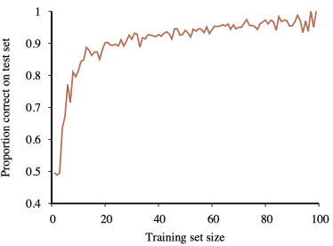
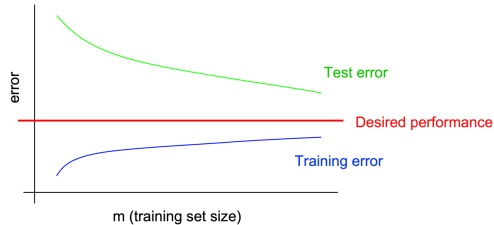

# Machine Learning Fundamentals
- There are different types of learning
- Supervised learning
    - Learns a function that maps from input to output
    - Trains with **labelled data**
- Unsupervised learning
    - Learns patterns from input
    - Trains with **unlabelled data** (comes up with labels itself)
- Semi-supervised learning
- Reinforcement learning
    - Learns from a series of <u>reinforcements</u>
    - Rewards and/or punishments

## Supervised Learning
- 2 broad categories:
    - Regression
        - Continuous target variable
        - Ex: house price prediction
        - Linear regression
    - Classification
        - Categorical target variable
        - Ex: email spam
        - Naive Bayes, Decision Trees
- We give the model a training set with example input-output pairs
    - Set: $(x_1,y_1),...(x_n,y_n)$
- There is some unknown function $y=f(x)$ that can map input to output
    - We want to find some function $h$ that *approximates* $f$
    - Called the <u>hypothesis function</u>
    - Comes from a hypothesis space $H$
    - Usually call $h$ the "model" as well
- Example hypotheses:

### Classification Examples
- Spam email example
    - Input: email
    - Output: label whether it's spam or not
    - Set up: obtain a large collection of sample emails
        - Each are labelled as to whether they are spam or not
    - Features:
        - Extract attributes from input data (word count, text patterns, etc.)
        - Attributes help decide whether it's ham or spam
- Digit recognition example
    - Input: images/L9/images/pixel grids
    - Output: a digit 0-9
    - Set up: obtain a large collection of sample images/L9/images, each labeled with a digit
    - Features: pixels, shape patterns, aspect ratio, etc.

## Unsupervised Learning
- Target variable is not available
    - No labeled data
- Clustering: K-means
    - Ex: document clustering 

### Example
- Topic modeling for news articles
    - Method: Latent Dirichlet Allocation (LDA)
    - Input: collection of news articles
    - Output: topics like "Politics", "Sports", "Tech", etc.
    - Features: word frequency, document frequency, N-grams, etc.

## Datasets

- Key parts are training and testing the model
    - A <u>learning curve</u> measures a model's performance as it learns from more data 
- There are 3 types of datasets:
    - Training set: trains the model that maps input to output
    - Validation set: evaluates models and chooses best model based on performance
    - Test set: final, unbiased evaluation of finalized model to assess performance
- Normal <u>parameters</u> are internal variables that the model learns through training
    - Model uses these to apply transformations to inputs to get output
    - <u>Hyperparameters</u> are external preset parameters

### Tuning Data
- We have 2 unknowns: parameters and hyperparameters
    - How do we know how to improve them and which ones?
- Start off by learning parameters from training data
- Tune hyperparameters with validation data
    - Validation data will evaluate how good the hyperparameters are
- Choose the best set of hyperparameters and run final test with test dataset

### Analysis
- The goal is for a classifier to do well on test data
    - There are a few pitfalls to avoid
- Overfitting
    - The model fits the data too closely
    - Not generalizing enough
    - High variance
- Underfitting
    - Model doesn't fit data enough
    - High bias
- We can diagnose problems using variance and bias
- Variance: training error is much lower than test error 
    - Large gap between training and test error
    - Try using a bigger training set with smaller set of features
- Bias: training error is also too high 
    - Small gab between training and test error
    - Try larger set of features
- Select the model with the lowest validation errors
    - Figure out parameters and hyperparameters
    - Compute accuracy of the test test
    - **Never** "peek" at test set to avoid writing bad models
